# Data Engineering — Nền tảng từ Storage đến Ingestion

> Mọi công cụ trong tài liệu này đều đi kèm ví dụ thực tế giải thích **tốt cho trường hợp nào, tại sao**.

---

## Mục lục

1. [Data Lake vs Data Warehouse](#1-data-lake-vs-data-warehouse)
2. [Schema-on-read vs Schema-on-write](#2-schema-on-read-vs-schema-on-write)
3. [OLTP vs OLAP](#3-oltp-vs-olap)
4. [Storage types](#4-storage-types)
5. [Ingestion patterns](#5-ingestion-patterns)
6. [Kỹ thuật đọc data nhanh](#6-kỹ-thuật-đọc-data-nhanh)
7. [Cheat sheet chọn công cụ](#7-cheat-sheet-chọn-công-cụ)
8. [CDC — diễn ra ở đâu](#8-cdc--diễn-ra-ở-đâu)
9. [Đọc 1 tỷ records](#9-đọc-1-tỷ-records)
10. [Tại sao incremental cần index — các method thay thế](#10-tại-sao-incremental-cần-index)
11. [Extract từ nguồn phân tán](#11-extract-từ-nguồn-phân-tán)
12. [Tất cả CDC methods — cơ chế, tối ưu, trade-off](#12-tất-cả-cdc-methods)
13. [DB Engine → Kafka — 1 tỷ records, bao nhiêu cách](#13-db-engine--kafka--1-tỷ-records)
14. [Glossary](#14-glossary)
15. [Ingestion — File & Batch đầy đủ](#15-ingestion--file--batch)
16. [Processing — làm gì sau khi ingest](#16-processing)
17. [Orchestration — điều phối pipeline](#17-orchestration)
18. [Observability & Tracking pipeline](#18-observability--tracking-pipeline)
19. [Hệ thống quy mô Netflix — vận hành thực tế](#19-hệ-thống-quy-mô-netflix)

---

## 1. Data Lake vs Data Warehouse

```mermaid
graph TD
    subgraph LAKE["Data Lake — lưu mọi thứ, hỏi sau"]
        L1[Nguồn thô\nJSON · CSV · logs · ảnh · video]
        L2[Object Storage\nS3 · GCS · ADLS]
        L3[Raw zone]
        L4[Curated zone]
        L5[Sandbox]
        L6[Query Engine\nSpark · Presto · Trino]
        L7[Data Scientist / ML]
        L8[Ad-hoc Analytics]
        L1 -->|ingest thô, không transform| L2
        L2 --> L3
        L2 --> L4
        L2 --> L5
        L3 & L4 & L5 --> L6
        L6 --> L7
        L6 --> L8
    end

    subgraph DWH["Data Warehouse — cấu trúc trước, hỏi nhanh"]
        W1[Nguồn có cấu trúc\nERP · CRM · RDBMS · SaaS]
        W2[ETL / ELT pipeline\ntransform + validate]
        W3[Staging layer\nlàm sạch · dedupe]
        W4[Columnar Storage\nStar schema · Snowflake schema]
        W5[Semantic / BI layer\nmetrics · dimensions]
        W6[BI Tools / Dashboard]
        W7[Reporting · KPI]
        W1 -->|transform trước khi load| W2
        W2 --> W3
        W3 --> W4
        W4 --> W5
        W5 --> W6
        W5 --> W7
    end
```

### So sánh nhanh

| Tiêu chí | Data Lake | Data Warehouse |
|---|---|---|
| Dữ liệu | Mọi định dạng, thô | Có cấu trúc, đã xử lý |
| Schema | On-read (linh hoạt) | On-write (nghiêm ngặt) |
| Chi phí lưu trữ | Rẻ (S3 ~$0.023/GB) | Đắt hơn 3–10x |
| Tốc độ query | Chậm hơn, scan nhiều | Rất nhanh, tối ưu sẵn |
| Người dùng chính | Data engineer, scientist | Analyst, BI, business |

### Ví dụ công cụ — tốt cho trường hợp nào

**AWS S3 + Apache Spark (Data Lake)**
Tốt cho: Grab lưu toàn bộ GPS event của tài xế (JSON, 50TB/ngày). Không biết trước sẽ cần phân tích gì — có thể sau 6 tháng mới cần train model dự đoán tắc đường. Dump thẳng vào S3, Spark đọc khi cần.
Không dùng cho: CFO hỏi "doanh thu Q3 theo tỉnh thành?" hàng ngày → query Spark chạy 20 phút, không chấp nhận được.

**Snowflake (Data Warehouse)**
Tốt cho: Tiki cần dashboard bán hàng realtime cho toàn bộ seller — mỗi seller F5 liên tục, cần query dưới 3 giây. Data đã biết schema: orders, products, users. ETL chạy mỗi giờ nạp vào Snowflake.
Không dùng cho: Lưu raw clickstream 500GB/ngày từ web crawler — schema chưa ổn định, đắt không cần thiết.

**Google BigQuery (Warehouse + Lake lai)**
Tốt cho: Startup nhỏ không có team data engineer riêng — BigQuery vừa serverless (không cần quản lý cluster), vừa chấp nhận JSON semi-structured, vừa query nhanh. Một công cụ cover cả hai use case.
Không dùng cho: On-premise, không muốn phụ thuộc GCP, hoặc cần sub-100ms query latency.

**Delta Lake / Apache Iceberg (Lakehouse)**
Tốt cho: Shopee có Data Lake trên S3 nhưng bị vấn đề: data scientist sửa Parquet file → corrupt, không có transaction. Chuyển sang Delta Lake: có ACID, time travel (rollback về snapshot cũ), schema enforcement. Vẫn rẻ như Lake nhưng reliable như Warehouse.

---

## 2. Schema-on-read vs Schema-on-write

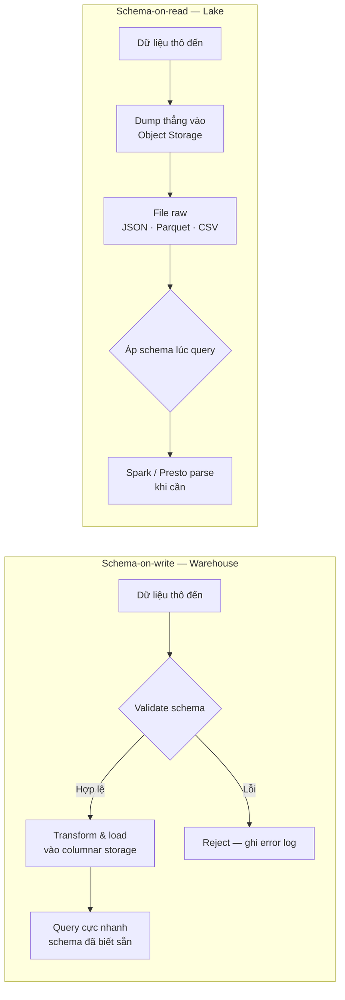

### Ví dụ thực tế từng trường hợp

**Schema-on-write — dùng khi: data shape đã biết, business cần số chính xác**

Ví dụ: VNPay xử lý giao dịch thanh toán. Schema cực kỳ chặt: `amount` phải là DECIMAL(18,2), `currency` phải là enum (VND/USD), `merchant_id` phải tồn tại trong bảng merchants. Nếu ghi sai → báo cáo tài chính sai → sai tiền thật. Dùng Redshift với schema-on-write: mọi transaction phải qua ETL validate trước, sai thì reject ngay.

```sql
-- ETL validate trước khi load vào Redshift
INSERT INTO transactions (id, amount, currency, merchant_id)
SELECT id, amount::DECIMAL(18,2), currency, merchant_id
FROM staging_transactions
WHERE amount > 0
  AND currency IN ('VND', 'USD')
  AND merchant_id IN (SELECT id FROM merchants)
-- Rows không hợp lệ → không được insert, ghi vào error_log
```

**Schema-on-read — dùng khi: data source chưa ổn định, cần ingestion nhanh**

Ví dụ: TikTok Vietnam thu thập user behavior event từ app — click, scroll, pause video, share. Mỗi version app mới lại thêm event type mới (v2.1 thêm "duet_click", v2.3 thêm "live_gift"). Nếu dùng schema-on-write, mỗi lần app release phải ALTER TABLE → downtime pipeline. Thay vào đó dump JSON thẳng vào S3. Khi data scientist cần phân tích event nào, Spark tự infer schema lúc đó.

```python
# Spark đọc S3, áp schema lúc query — không cần định nghĩa trước
df = spark.read.json("s3://tiktok-events/raw/2024/01/15/")
# Spark tự infer: {event_type: string, user_id: long, video_id: string, ...}
df.filter(df.event_type == "duet_click").groupBy("user_id").count().show()
```

---

## 3. OLTP vs OLAP

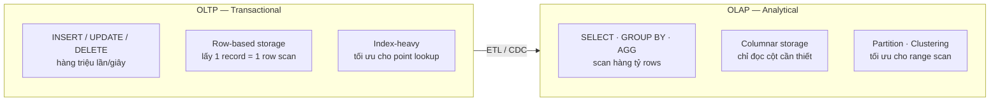

### Ví dụ phân biệt OLTP vs OLAP

**PostgreSQL — OLTP, tốt cho:**
Lazada order service: mỗi giây có 5,000 user checkout đồng thời. Mỗi checkout cần INSERT orders + UPDATE inventory + UPDATE wallet balance trong cùng 1 transaction (ACID). PostgreSQL xử lý được vì row-based storage + MVCC isolation. Nếu dùng BigQuery (OLAP) cho việc này: BigQuery không có row-level locking, không có sub-millisecond transaction → checkout sẽ bị lỗi duplicate và race condition.

**BigQuery — OLAP, tốt cho:**
Lazada analytics team cần query: "Top 100 sản phẩm bán chạy nhất tháng 1 theo tỉnh thành, so sánh với tháng 1 năm ngoái." Query này scan 2 tỷ order records. BigQuery columnar storage chỉ đọc 3 cột (product_id, province, order_date) thay vì toàn bộ row → chạy 8 giây. Nếu chạy query này trên PostgreSQL OLTP production: full table scan 2 tỷ rows, kill DB, các user đang checkout bị timeout.

> **Sai lầm kinh điển:** Dùng BigQuery / Redshift để INSERT từng transaction realtime → BigQuery không tối ưu cho write nhiều lần nhỏ, tốn tiền, chậm. Đó là việc của PostgreSQL/MySQL.

---

## 4. Storage Types

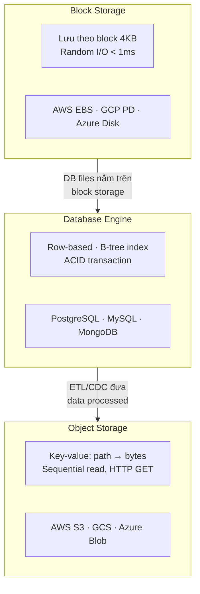

### 4.1 Database Storage — ví dụ thực tế

**PostgreSQL — tốt cho: OLTP nhiều write, cần ACID**
Sendo flash sale: 10,000 user cùng click mua 1 sản phẩm còn 1 cái. PostgreSQL dùng `SELECT FOR UPDATE` để lock row, chỉ 1 user thắng, 9,999 user nhận "hết hàng" — không bao giờ oversell. MySQL/MongoDB cũng làm được nhưng PostgreSQL mạnh hơn về isolation level.

**MySQL — tốt cho: Web app truyền thống, team quen MySQL**
MoMo dùng MySQL cho user account service — hàng trăm triệu user, query đơn giản (SELECT by user_id, UPDATE balance). MySQL binlog rất mature → CDC với Debezium dễ setup. Không cần tính năng phức tạp của PostgreSQL.

**MongoDB — tốt cho: Schema linh hoạt, document nested**
Zalo lưu message: mỗi message có structure khác nhau (text/image/sticker/voice có metadata khác nhau). MongoDB document model phù hợp hơn relational — không cần JOIN nhiều bảng. Nhưng không dùng MongoDB cho financial transaction vì ACID kém hơn PostgreSQL (chỉ từ MongoDB 4.0 mới có multi-document transaction).

**Cassandra — tốt cho: Write rất cao, time-series, geo-distributed**
Agoda lưu hotel availability: 500K hotels × 365 ngày × 10 room types = hàng tỷ records cần update realtime khi có booking. Cassandra LSM-tree tối ưu cho write-heavy, partition by hotel_id → mỗi node chỉ handle một subset hotel. PostgreSQL sẽ chết với write throughput này.

### 4.2 Block Storage — ví dụ thực tế

**AWS EBS gp3 — tốt cho: Database production cần IOPS cao**
Một fintech startup dùng PostgreSQL trên EC2 với EBS gp3 (16,000 IOPS, 1GB/s throughput). Latency < 0.5ms cho random read/write. Tại sao không dùng S3 cho DB files? Vì S3 latency ~10ms — PostgreSQL cần đọc/ghi từng 8KB page hàng ngàn lần/giây, 10ms × 1000 = 10 giây chỉ riêng I/O.

**AWS EBS io2 Block Express — tốt cho: Database lớn, mission-critical**
VPBank core banking system: Oracle DB 20TB, cần 256,000 IOPS, sub-millisecond latency. EBS io2 Block Express là lựa chọn duy nhất trên AWS cho requirement này. Chi phí: ~$0.125/GB/month × 20,000GB = $2,500/month chỉ riêng storage — đắt hơn S3 10x nhưng không có lựa chọn khác cho Oracle performance requirement.

**Local NVMe SSD — tốt cho: Temporary storage, cache layer**
Kafka broker dùng local NVMe SSD cho log storage: throughput 3GB/s, latency < 0.1ms. Không dùng EBS vì network-attached storage thêm latency. Trade-off: nếu host chết → data mất (nhưng Kafka replication bù lại).

### 4.3 Object Storage — ví dụ thực tế

**AWS S3 — tốt cho: Data lake, backup, static asset**

Ví dụ 1 — Data Lake: Be Group lưu toàn bộ trip data (GPS coordinates mỗi 2 giây, 1 triệu trips/ngày) vào S3 dạng Parquet. Cost: $0.023/GB × 50TB/tháng = $1,150/tháng. Nếu dùng EBS: $0.08/GB × 50,000GB = $4,000/tháng. S3 tiết kiệm 3.5x và không cần quản lý disk.

Ví dụ 2 — Không dùng S3 cho: Redis session cache. User login → cần lấy session trong < 1ms. S3 latency 10–100ms → user cảm nhận được lag mỗi lần request cần auth.

```python
# S3 tốt: đọc file Parquet lớn theo cột (sequential)
# Spark đọc 100 files song song, mỗi file chỉ đọc cột cần
df = spark.read.parquet("s3://be-datalake/trips/date=2024-01-15/")
df.filter(df.city == "HCM").groupBy("driver_id").agg(F.sum("distance")).show()

# S3 không tốt: random read từng record
# 10ms × 10,000 records = 100 giây — dùng DynamoDB thay thế
```

**GCS (Google Cloud Storage) — tốt cho: Stack Google Cloud, ML training**
VNG dùng GCS để lưu training data cho recommendation model của Zing MP3. BigQuery ML đọc trực tiếp từ GCS, không cần copy data. Nếu dùng AWS S3 thì phải cross-cloud transfer → tốn tiền egress.

**MinIO — tốt cho: On-premise, private cloud, S3-compatible**
Vietcombank không được phép đưa data lên public cloud (regulatory). MinIO deploy on-premise, S3-compatible API → toàn bộ data pipeline code dùng boto3 (AWS SDK) vẫn chạy được mà không đổi code, chỉ đổi endpoint.

---

## 5. Ingestion Patterns

```mermaid
graph TD
    subgraph BATCH["Batch"]
        B1[Schedule: hàng giờ/ngày]
        B2[Extract full hoặc incremental]
        B3[Transform]
        B4[Load]
        B1 --> B2 --> B3 --> B4
    end
    subgraph STREAM["Streaming"]
        S1[Event emit ngay lập tức]
        S2[Kafka · Kinesis · Pub/Sub]
        S3[Flink · Spark Streaming]
        S4[Sink realtime]
        S1 --> S2 --> S3 --> S4
    end
    subgraph CDC["CDC"]
        C1[DB thay đổi INSERT/UPDATE/DELETE]
        C2[Transaction log binlog / WAL]
        C3[Debezium · Maxwell]
        C4[Kafka topic per table]
        C5[Consumer: DWH / Lake]
        C1 --> C2 --> C3 --> C4 --> C5
    end
```

### Ví dụ từng pattern — tốt cho trường hợp nào

**Batch — Airflow + Spark**
Tốt cho: Tiki cần báo cáo doanh thu hàng ngày gửi email cho CEO lúc 7am. Airflow schedule job 5am, Spark đọc toàn bộ orders của ngày hôm qua từ PostgreSQL, aggregate, ghi vào Redshift. Không cần realtime — batch hoàn toàn đủ.
Không dùng cho: Phát hiện gian lận credit card — khi Spark batch chạy xong thì user đã mất tiền rồi.

**Batch — Airbyte**
Tốt cho: Marketing team cần sync data từ Salesforce CRM + HubSpot + Google Ads vào Data Warehouse để xem campaign performance. Airbyte có sẵn 300+ connector, không cần tự code ETL. Schedule sync mỗi 4 giờ là đủ.
Không dùng cho: Sub-second realtime sync — Airbyte không được thiết kế cho latency thấp.

**Streaming — Apache Kafka + Flink**
Tốt cho: MoMo phát hiện giao dịch gian lận realtime. Mỗi payment event → Kafka → Flink check rule trong < 500ms (so sánh với lịch sử giao dịch, device fingerprint, location) → block hoặc approve. Batch không làm được vì user đã chuyển tiền xong mới phát hiện.
Không dùng cho: Báo cáo tổng hợp hàng tháng — Flink cluster always-on tốn tiền, overkill cho use case không cần realtime.

**Streaming — AWS Kinesis**
Tốt cho: Team đã lock-in AWS, cần managed service không muốn tự quản lý Kafka cluster. Game mobile lưu player event (kill, death, item pickup) realtime cho leaderboard. Kinesis auto-scale, không cần lo rebalancing.
Không dùng cho: Cần event retention > 7 ngày (Kinesis max 365 ngày nhưng đắt), hoặc cần consumer group phức tạp như Kafka.

**CDC — Debezium + Kafka**
Tốt cho: Shopee cần sync bảng `orders` từ MySQL (OLTP) vào Elasticsearch (search) và BigQuery (analytics) realtime. Khi order status thay đổi "pending" → "shipped", Elasticsearch phải update ngay để user search thấy trạng thái đúng. Debezium đọc MySQL binlog, emit event lên Kafka, 2 consumer (ES và BigQuery) đọc độc lập.
Không dùng cho: Table không có replication enabled, hoặc DBA không cho phép CDC user.

**CDC — Fivetran**
Tốt cho: Startup 5 người không có Data Engineer, cần sync PostgreSQL → Snowflake. Fivetran setup trong 30 phút, tự handle schema change, tự retry khi fail, có UI monitor. Đắt hơn tự build nhưng không cần maintain.
Không dùng cho: Budget thấp (Fivetran charge theo MAR — Monthly Active Rows, có thể rất đắt với volume lớn), hoặc cần custom transform phức tạp.

### Delivery Semantics — ví dụ tác động thực tế

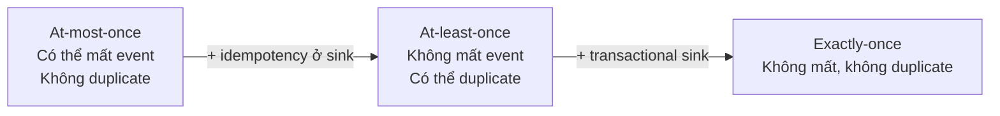

**At-most-once** — chấp nhận được cho: log analytics, click tracking. Mất 0.01% event không ảnh hưởng business.

**At-least-once** — cần idempotency: MoMo payment event có thể duplicate khi Kafka retry. Sink phải dùng `INSERT ... ON CONFLICT DO UPDATE` (upsert) để tránh ghi 2 lần cùng 1 transaction.

**Exactly-once** — cần cho: banking transaction. Kafka Transactions + Flink checkpointing đảm bảo mỗi giao dịch chỉ được process đúng 1 lần. Nhưng đắt về complexity và latency.

---

## 6. Kỹ thuật đọc data nhanh

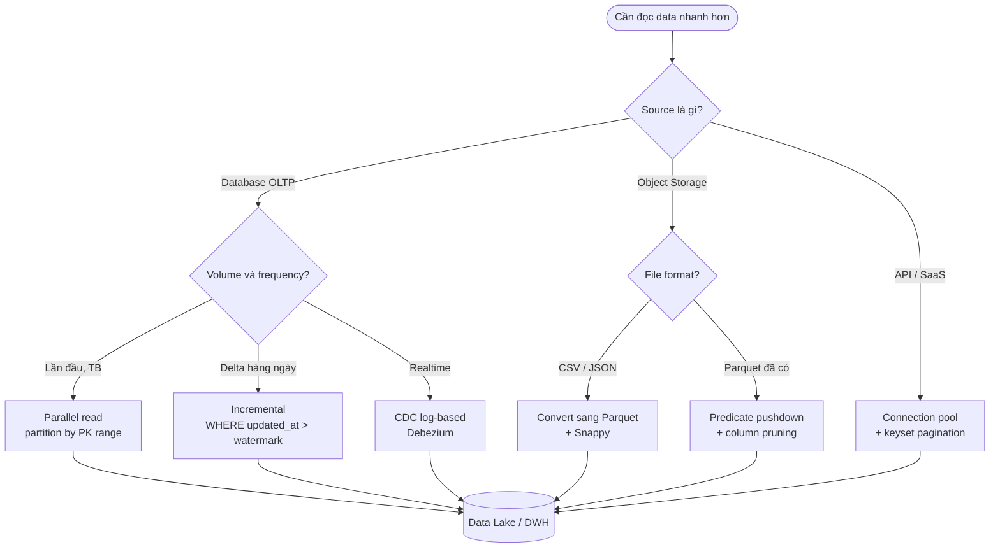

### Ví dụ từng kỹ thuật — tốt cho trường hợp nào

**1. Parallel read + partitioning — tốt cho: historical bulk load lần đầu**

Ví dụ: Tiki migrate 800M order records từ MySQL sang BigQuery lần đầu. Single-thread JDBC đọc 800M rows mất 40 giờ. Chia 100 partitions, 100 Spark executor chạy song song:
```python
df = spark.read.jdbc(
    url="jdbc:mysql://tiki-prod-db:3306/ecommerce",
    table="orders",
    column="id",
    lowerBound=0, upperBound=800_000_000,
    numPartitions=100,
    properties={"fetchsize": "10000"}
)
# 40 giờ → 25 phút (100 parallel connections)
```
Không dùng cho: Table không có numeric partition column, hoặc DB không chịu được 100 connection đồng thời.

**2. Incremental read — tốt cho: daily sync với volume vừa**

Ví dụ: Sendo sync orders mới trong ngày vào Data Warehouse. Mỗi ngày chỉ có 500K orders mới thay vì 200M total. Airflow chạy lúc 1am:
```sql
-- Chỉ lấy orders tạo/cập nhật trong 24 giờ qua
SELECT * FROM orders
WHERE updated_at > CURRENT_TIMESTAMP - INTERVAL '24 hours'
ORDER BY updated_at;
-- 500K rows thay vì 200M → nhanh hơn 400x
```
Không dùng cho: Cần capture DELETE (đơn hàng bị hủy và xóa khỏi DB).

**3. CDC log-based — tốt cho: realtime sync, cần capture DELETE**

Ví dụ: Sendo cần sync order cancellation realtime. Khi merchant cancel order, status thay đổi và đôi khi row bị DELETE. Incremental query bỏ sót DELETE. Debezium đọc MySQL binlog:
```
MySQL binlog event:
  {op: "d", before: {id: 12345, status: "cancelled"}, lsn: 4587234}
→ Debezium emit lên Kafka topic "sendo.orders"
→ Elasticsearch consumer: delete document id=12345
→ BigQuery consumer: UPDATE orders SET is_deleted=true WHERE id=12345
```
Latency: < 2 giây từ khi MySQL commit đến khi Elasticsearch updated.

**4. Parquet + predicate pushdown — tốt cho: file-based analytics trên S3**

Ví dụ: Data Science team Grab cần phân tích trip data theo city = "HCM" trong tháng 1/2024. File CSV: 500GB, Spark đọc hết 500GB. File Parquet phân theo date + city:
```
s3://grab-datalake/trips/year=2024/month=01/city=HCM/part-0001.parquet (2GB)
s3://grab-datalake/trips/year=2024/month=01/city=HCM/part-0002.parquet (2GB)
...
```
Spark chỉ đọc ~40GB thay vì 500GB → nhanh hơn 12x. Thêm predicate pushdown trên column distance → chỉ đọc bytes của column đó trong Parquet.

**5. Connection pooling — tốt cho: nhiều job nhỏ chạy song song**

Ví dụ: Airflow có 50 task chạy song song, mỗi task query PostgreSQL. Không có pool: 50 task × 150ms connection overhead = 7.5 giây chỉ riêng handshake. Với PgBouncer (connection pool):
```
50 tasks → PgBouncer (giữ sẵn 20 connections với PostgreSQL)
→ Task lấy connection sẵn có: < 1ms
→ Tiết kiệm 7.5 giây per batch run
→ PostgreSQL không bị overwhelm bởi 50 connections mới đồng thời
```

**6. Network locality — tốt cho: cross-region pipeline**

Ví dụ thực tế sai: Một công ty VN đặt Spark cluster ở Singapore (AWS ap-southeast-1) nhưng source PostgreSQL ở Frankfurt (eu-central-1). Round-trip latency 200ms. 1 triệu keyset queries = 200ms × 1M = 55 giờ chỉ riêng network. Fix: chạy Spark cluster cùng region với DB ở Frankfurt, latency 0.3ms → 5 phút.

---

## 7. Cheat sheet chọn công cụ

### Chọn storage

| Bài toán | Tool | Tại sao |
|---|---|---|
| OLTP: checkout, payment, account | PostgreSQL | ACID mạnh nhất, MVCC, mature |
| OLTP: write cực cao, time-series | Cassandra | LSM-tree tối ưu append, distributed |
| Cache, session, leaderboard | Redis | In-memory, < 1ms, data structure phong phú |
| DB files production | AWS EBS gp3/io2 | Random I/O < 1ms, attach trực tiếp vào EC2 |
| Data lake petabyte | AWS S3 | $0.023/GB, 11 nines durability, parallel GET |
| On-premise S3-compatible | MinIO | Regulatory compliance, S3 API compatible |
| Warehouse: BI, SQL, dashboard | Snowflake | Separation compute/storage, auto-scale |
| Warehouse: Google stack, ML | BigQuery | Serverless, tích hợp tốt với Vertex AI |

### Chọn ingestion pattern

| Latency | Volume | Pattern | Tool | Ví dụ use case |
|---|---|---|---|---|
| Giờ/ngày | TB | Batch full | Airflow + Spark | Báo cáo doanh thu ngày |
| Phút | GB | Batch incremental | Airbyte, Fivetran | Sync SaaS API hàng giờ |
| Giây | MB delta | CDC | Debezium + Kafka | Sync MySQL → Elasticsearch |
| Sub-second | Continuous | Streaming | Kafka + Flink | Fraud detection, live leaderboard |

### Chọn kỹ thuật đọc nhanh

| Bài toán | Kỹ thuật | Tool | Tại sao |
|---|---|---|---|
| 500M rows lần đầu từ MySQL | Parallel JDBC 100 partitions | Spark | 100 connection đồng thời, mỗi cái đọc 5M rows |
| Daily delta, no DELETE | Incremental WHERE updated_at | Airflow + psycopg2 | Chỉ đọc rows thay đổi |
| Realtime + cần DELETE | CDC log-based | Debezium | Đọc binlog, zero DB query load |
| Parquet trên S3, filter theo ngày | Partition pruning + predicate pushdown | Spark / Athena | Skip 90% files và bytes |
| 50 Airflow tasks query DB cùng lúc | Connection pool | PgBouncer | Tái dùng connection, giảm overhead |

---

## 8. CDC — diễn ra ở đâu

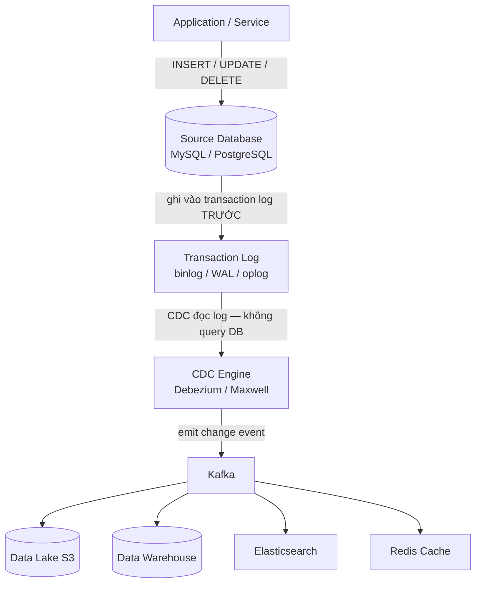

### CDC xảy ra ở tầng transaction log

Khi `UPDATE orders SET status='shipped' WHERE id=123`:
```
1. App gửi SQL → DB engine
2. DB ghi vào WAL/binlog TRƯỚC (write-ahead guarantee)
3. DB áp lên data pages trên disk
4. Debezium đọc WAL → thấy {op:UPDATE, before:{status:pending}, after:{status:shipped}, lsn:4587234}
5. Debezium emit event lên Kafka topic "shopee.orders"
6. 4 consumer nhận event và xử lý độc lập
```

### Ví dụ thực tế: Shopee multi-consumer CDC

**Setup:** MySQL (orders table) → Debezium → Kafka → 4 consumers

```yaml
# Debezium connector
connector.class: io.debezium.connector.mysql.MySqlConnector
database.hostname: shopee-prod-db.internal
database.include.list: ecommerce
table.include.list: ecommerce.orders
topic.prefix: shopee
snapshot.mode: initial   # snapshot toàn bộ, rồi streaming
```

```json
// Event trên Kafka topic "shopee.orders"
{
  "op": "u",
  "before": {"id": 99, "status": "pending", "user_id": 555},
  "after":  {"id": 99, "status": "shipped", "user_id": 555},
  "source": {"db": "ecommerce", "table": "orders", "file": "mysql-bin.000127", "pos": 4587234}
}
```

**Consumer 1 — Elasticsearch:** Update document để user search thấy "shipped" ngay lập tức.
**Consumer 2 — BigQuery:** Upsert vào analytics table cho báo cáo.
**Consumer 3 — Redis:** Invalidate cache `order:99` → lần sau user refresh thấy status mới.
**Consumer 4 — Notification Service:** Gửi push notification "Đơn hàng của bạn đã được giao."

Latency end-to-end: MySQL commit → user nhận notification: < 3 giây.

### CDC theo từng DB

| Database | Log | Cơ chế | Tool |
|---|---|---|---|
| MySQL / MariaDB | binlog | Row-based replication protocol | Debezium MySQL, Maxwell, Canal |
| PostgreSQL | WAL | Logical replication slot + pgoutput | Debezium PG |
| MongoDB | oplog | Tailable cursor trên local.oplog.rs | Debezium MongoDB |
| Oracle | Redo log | LogMiner API | Debezium Oracle, GoldenGate |
| SQL Server | CDC tables | sys.fn_cdc_get_all_changes_* | Debezium SQL Server |

---

## 9. Đọc 1 tỷ records

### Tại sao single query thất bại

```
SELECT * FROM orders LIMIT 1000000000
→ 1B × 200 bytes = 200GB RAM trên client → OOM crash
→ Network: 200GB qua TCP = nhiều giờ
→ DB giữ cursor mở hàng giờ → block vacuum, tốn connection
→ Timeout sau 30–60 phút (DB default)
```

### Kiến trúc phân tán

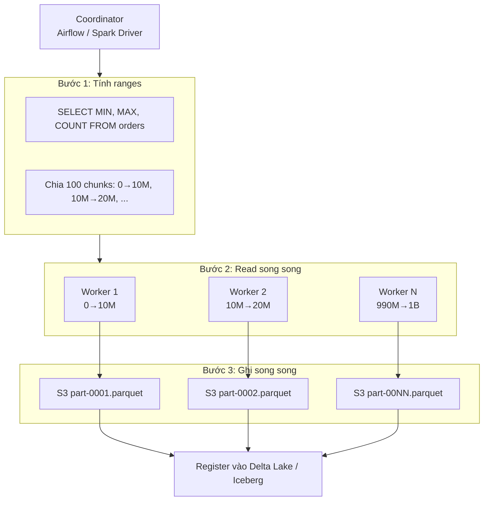

### Ví dụ thực tế: Tiki migrate 1 tỷ orders sang BigQuery

**Bài toán:** Tiki cần migrate toàn bộ lịch sử order (1 tỷ rows, 250GB) từ MySQL sang BigQuery. Một lần duy nhất, không cần realtime.

**Lý do chọn Spark parallel JDBC thay vì các cách khác:**
- Debezium: snapshot mode quá chậm với single thread, giữ MySQL transaction lâu
- mysqldump: export ra file CSV rồi load vào BigQuery — chậm vì không parallel
- Spark JDBC: parallel, tận dụng cluster sẵn có, ghi thẳng ra GCS Parquet

```python
spark = SparkSession.builder.getOrCreate()

# Bước 1: lấy bounds (1 query nhỏ)
bounds = spark.read.jdbc(
    url="jdbc:mysql://tiki-mysql:3306/ecommerce",
    table="(SELECT MIN(id) mn, MAX(id) mx FROM orders) t",
    properties={"user": "spark_reader", "password": "..."}
).collect()[0]

# Bước 2: đọc song song 200 partitions
df = spark.read.jdbc(
    url="jdbc:mysql://tiki-mysql:3306/ecommerce",
    table="orders",
    column="id",
    lowerBound=bounds["mn"],
    upperBound=bounds["mx"],
    numPartitions=200,
    properties={"fetchsize": "50000", "user": "spark_reader", "password": "..."}
)

# Bước 3: ghi Parquet ra GCS (partition theo ngày để query sau nhanh)
df.write.mode("overwrite").partitionBy("order_date").parquet("gs://tiki-lake/orders/")

# Bước 4: load từ GCS vào BigQuery
# bq load --source_format=PARQUET tiki_dw.orders 'gs://tiki-lake/orders/*.parquet'
```

**Kết quả:**
- Single thread JDBC: 40 giờ
- Spark 200 partitions trên cluster 20 executor: 22 phút
- Chi phí Spark cluster: ~$15

### Xử lý skew — khi ID không phân bổ đều

**Vấn đề:** Orders ID từ 1→1B nhưng phần lớn là 800M→1B (hệ thống mới dùng nhiều). 90% data nằm trong 10% range cuối.

```python
# Giải pháp: partition bằng hash thay vì range
df = spark.read.jdbc(
    url=jdbc_url,
    table="(SELECT *, MOD(id, 200) AS shard_key FROM orders) t",
    column="shard_key",
    lowerBound=0,
    upperBound=199,
    numPartitions=200,
    # Mỗi partition = 0.5% data, phân bổ đều hơn
)
```

### Checkpoint — resume khi fail giữa chừng

**Vấn đề:** Job chạy 20 phút, fail ở chunk 87/100. Không có checkpoint → phải chạy lại từ đầu.

```python
import json, os

CKPT = "/tmp/tiki_migration.json"

def load_ckpt():
    if os.path.exists(CKPT):
        return json.load(open(CKPT))["done"]
    return set()

def save_ckpt(done_set):
    json.dump({"done": list(done_set)}, open(CKPT, "w"))

done = load_ckpt()
chunks = [(i*10_000_000, (i+1)*10_000_000) for i in range(100)]

for i, (lo, hi) in enumerate(chunks):
    if i in done:
        print(f"Skip chunk {i}")
        continue
    # đọc và ghi chunk này
    process_chunk(spark, jdbc_url, lo, hi, f"gs://tiki-lake/orders/chunk={i:04d}/")
    done.add(i)
    save_ckpt(done)
    print(f"Done chunk {i}: {lo:,} → {hi:,}")
```

---

## 10. Tại sao incremental cần index

### Vấn đề cốt lõi

```sql
-- Không có index trên updated_at
SELECT * FROM orders WHERE updated_at > '2024-01-15 00:00:00';
-- EXPLAIN: Seq Scan on orders (cost=0..2500000 rows=1000000000)
-- Đọc TOÀN BỘ 1 tỷ rows → không khác gì full scan

-- Có index
CREATE INDEX idx_orders_updated_at ON orders(updated_at);
SELECT * FROM orders WHERE updated_at > '2024-01-15 00:00:00';
-- EXPLAIN: Index Scan using idx_orders_updated_at
-- Chỉ đọc 50K rows mới nhất → nhanh hơn 20,000x
```

### 5 method thay thế — ví dụ thực tế

#### Method 1: CDC log-based — không cần index, tốt nhất cho realtime

**Tốt cho:** Sendo cần sync order cancellation realtime. DELETE không để lại `updated_at` để query. Debezium đọc MySQL binlog, bắt cả DELETE event.
```
Binlog event: {op:"d", before:{id:12345, status:"cancelled"}, lsn:7890}
→ Consumer xóa record tương ứng trong Elasticsearch
```
**Không dùng khi:** DBA không cho phép tạo replication user, hoặc DB không support logical replication.

#### Method 2: Auto-increment ID — dùng PK index sẵn có, tốt cho append-only

**Tốt cho:** Zalopay lưu payment event log — chỉ có INSERT, không bao giờ UPDATE/DELETE. PK index luôn có sẵn, không cần tạo thêm.
```sql
-- Zalopay: lấy events mới hơn last processed
SELECT * FROM payment_events WHERE id > :last_id ORDER BY id LIMIT 100000;
-- Dùng PK index → nhanh, không cần index riêng
```
**Không dùng khi:** Table có UPDATE (order status change) → sẽ bỏ sót.

#### Method 3: Partition-based — không cần index, tốt cho data đã partition sẵn

**Tốt cho:** Grab lưu trip data đã partition theo ngày. Airflow chạy mỗi ngày lấy đúng partition hôm qua.
```sql
-- Grab: MySQL table partition by RANGE(TO_DAYS(trip_date))
SELECT * FROM trips WHERE trip_date = '2024-01-15';
-- MySQL chỉ scan partition tháng 1/2024, skip các partition khác
-- Không cần index on trip_date vì partition pruning đã handle
```

#### Method 4: DB-native export — bypass query layer, tốt cho bulk periodic export

**Tốt cho:** VCB cần daily export toàn bộ transaction table ra file để reconcile với core banking. `COPY TO` nhanh hơn JDBC vì đọc trực tiếp heap, không qua query planner.
```bash
# PostgreSQL COPY — nhanh hơn SELECT JDBC 3-5x
psql -U vcb_reader vcb_db -c \
  "COPY (SELECT * FROM transactions WHERE date='2024-01-15') TO STDOUT CSV HEADER" \
  | gzip | aws s3 cp - s3://vcb-exports/transactions/2024-01-15.csv.gz
```

#### Method 5: Trigger-based — tốt cho legacy DB không có CDC

**Tốt cho:** Một hệ thống Oracle 15 tuổi, DBA không cho phép LogMiner (cần license thêm), nhưng cho phép tạo trigger.
```sql
-- Oracle trigger ghi vào staging
CREATE OR REPLACE TRIGGER trg_orders_cdc
AFTER INSERT OR UPDATE OR DELETE ON orders
FOR EACH ROW
BEGIN
  INSERT INTO orders_cdc_staging VALUES(
    SYS_GUID(), 'ORDERS',
    CASE WHEN INSERTING THEN 'I' WHEN UPDATING THEN 'U' ELSE 'D' END,
    :OLD.id, :NEW.id, SYSDATE
  );
END;
-- Relay process đọc staging → Kafka mỗi 30 giây
```
**Không dùng khi:** Table có > 5,000 writes/giây — trigger sẽ tăng latency đáng kể.

### So sánh 5 methods

| Method | Index cần? | Capture DELETE? | DB Load | Latency | Tốt nhất khi |
|---|---|---|---|---|---|
| CDC log-based | Không | Có | ~0 | Sub-giây | Production OLTP, cần realtime + DELETE |
| Timestamp poll | Có (updated_at) | Không | Thấp | Phút | Simple setup, không cần DELETE |
| Auto-increment ID | Không (PK) | Không | Thấp | Phút | Append-only log table |
| Partition-based | Không | Có (nếu partition đúng) | Thấp | Giờ | Data đã partition theo thời gian |
| DB-native export | Không | Có | Trung bình | Giờ | Bulk periodic, consistent snapshot |
| Trigger-based | Không | Có | Cao (+20–50%) | Giây | Legacy DB không có CDC support |

---

## 11. Extract từ nguồn phân tán

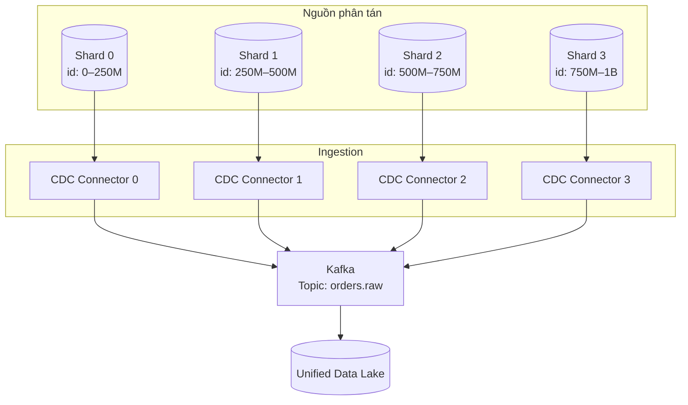

### Pattern 1: Scatter-gather — tốt cho query-based extraction từ nhiều shard

**Tốt cho:** Tiki sharding MySQL theo user_id (4 shard). Cần extract toàn bộ user data hàng ngày vào BigQuery.

```python
from concurrent.futures import ThreadPoolExecutor, as_completed

SHARDS = [
    {"host": "tiki-db-0.internal", "range": (0, 25_000_000)},
    {"host": "tiki-db-1.internal", "range": (25_000_000, 50_000_000)},
    {"host": "tiki-db-2.internal", "range": (50_000_000, 75_000_000)},
    {"host": "tiki-db-3.internal", "range": (75_000_000, 100_000_000)},
]

def extract_shard(shard):
    conn = connect(shard["host"])
    lo, hi = shard["range"]
    rows = conn.execute(
        "SELECT * FROM users WHERE id BETWEEN %s AND %s AND updated_at > %s",
        (lo, hi, yesterday)
    ).fetchall()
    write_to_gcs(rows, f"gs://tiki-lake/users/shard={shard['host']}/")
    return len(rows)

with ThreadPoolExecutor(max_workers=4) as pool:
    futures = {pool.submit(extract_shard, s): s for s in SHARDS}
    total = sum(f.result() for f in as_completed(futures))
print(f"Extracted {total:,} rows from 4 shards")
```

### Pattern 2: Một CDC connector per shard — tốt cho realtime sync

**Tốt cho:** Shopee 8 shard MySQL, cần sync realtime vào Kafka. Mỗi shard có 1 Debezium instance riêng.

```
Shard 0 binlog → Debezium-0 → Kafka topic: shopee.orders (partition 0–11)
Shard 1 binlog → Debezium-1 → Kafka topic: shopee.orders (partition 12–23)
...
Shard 7 binlog → Debezium-7 → Kafka topic: shopee.orders (partition 84–95)

Key routing: order_id % 96 → partition (đảm bảo cùng order vào cùng partition)
```

### Pattern 3: Multi-region federation — tốt cho data trải rộng nhiều vùng địa lý

**Tốt cho:** Grab có DB ở SG, VN, TH, ID. Không thể cross-region query do latency (~200ms).

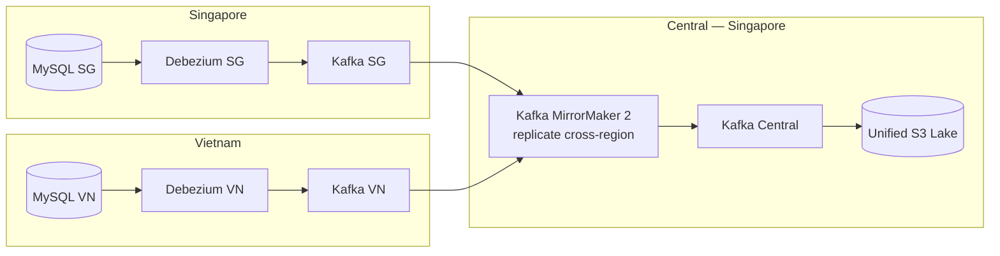

### Pattern 4: Trino/Presto federation — tốt cho ad-hoc query, không phải pipeline

**Tốt cho:** Data analyst cần ad-hoc join nhiều nguồn để khám phá data, không cần ETL pipeline phức tạp.
**Không dùng cho:** Production pipeline volume lớn — Trino federation latency cao, không scale cho 1B rows.

```sql
-- Trino query 3 nguồn trong 1 câu SQL — chỉ dùng cho ad-hoc
SELECT o.order_id, u.name, p.product_name
FROM mysql_sg.orders o              -- MySQL Singapore
JOIN postgresql_vn.users u ON o.user_id = u.id   -- PostgreSQL Vietnam
JOIN mongodb_th.products p ON o.product_id = p._id  -- MongoDB Thailand
WHERE o.created_at > NOW() - INTERVAL '1 day'
-- Trino pushdown filter xuống từng source, chỉ pull data cần
```

### Thách thức phân tán và cách xử lý

| Thách thức | Ví dụ thực tế | Giải pháp |
|---|---|---|
| Global ordering | Event UPDATE từ Shard 2 đến trước INSERT từ Shard 1 | Dùng order_id làm Kafka key — cùng order vào cùng partition, ordered |
| Partial failure | Shard 3 chết lúc 2am, 3 shard còn lại vẫn chạy | Checkpoint per shard, retry độc lập, alert riêng per shard |
| Schema drift | Shard 0 DBA thêm cột `promo_code`, Shard 1 chưa có | Confluent Schema Registry: backward compatible schema change |
| Hot shard | 70% Shopee orders đến từ SG shard | Re-shard bằng hash(order_id) thay vì range, hoặc CDC bypass query load |
| Clock skew | Server VN chậm 3 giây so với server SG | Dùng LSN/binlog position thay vì timestamp để ordering |

---

## 12. Tất cả CDC methods

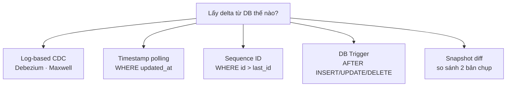

### Method 1: Log-based CDC — Debezium / Maxwell

**Cơ chế:** Đọc WAL/binlog trực tiếp. Không query DB, không tạo load.

**Tốt cho — ví dụ:**
- **Shopee Order → Search:** Khi seller update giá sản phẩm, Elasticsearch phải update ngay. Debezium bắt UPDATE event từ MySQL binlog, emit lên Kafka, ES consumer index lại trong < 2 giây. Batch poll 5 phút sẽ có 5 phút user tìm sản phẩm thấy giá cũ.
- **MoMo Ledger:** Mỗi transaction cần phản ánh vào nhiều hệ thống (risk engine, reporting, notification). Một binlog event → fan-out 4 Kafka consumer. Không cần query DB 4 lần.
- **Audit log đầy đủ:** Ngân hàng cần lịch sử mọi thay đổi account (ai thay đổi gì, lúc nào). Log-based CDC capture đủ before/after mọi row, không bỏ sót intermediate state.

**Không dùng khi — ví dụ:**
- Startup 3 người không có DevOps: setup Debezium + Kafka Connect cluster + monitoring mất 2 tuần. Airbyte incremental đơn giản hơn nhiều.
- DBA cấm tạo replication user vì security policy.

**Tools:**
- **Debezium** (open source, Kafka Connect plugin): hỗ trợ MySQL, PostgreSQL, MongoDB, Oracle, SQL Server. Production-grade, được dùng bởi Airbnb, Booking.com.
- **Maxwell** (open source, chỉ MySQL): đơn giản hơn Debezium, output JSON ra Kafka/stdout. Tốt cho team nhỏ chỉ cần MySQL CDC.
- **Canal** (Alibaba, MySQL binlog): phổ biến ở Việt Nam do stack China tech. Dùng Java, GUI admin panel.

### Method 2: Timestamp polling

**Tốt cho — ví dụ:**
- **Tiki daily sync:** Sync orders table vào Data Warehouse mỗi đêm lúc 2am. Team nhỏ, không có Kafka, không cần realtime. `WHERE updated_at > yesterday` kéo ~200K orders mới về Redshift. Đơn giản, reliable, đủ dùng.
- **SaaS API sync:** HubSpot API trả về contacts với `updated_at` field. Airbyte dùng timestamp polling để sync incrementally. Không có log access vì là external API.

**Không dùng khi — ví dụ:**
- **Cần capture DELETE:** Lazada hủy order và xóa row khỏi DB. Timestamp poll bỏ sót hoàn toàn. Dùng CDC log-based hoặc soft-delete pattern thay thế.
- **Table write > 100K rows/phút:** Index trên `updated_at` sẽ là hot spot — mọi write đều update index tại vị trí cuối → index page contention.

### Method 3: Sequence ID polling

**Tốt cho — ví dụ:**
- **Zalopay transaction log:** Insert-only table, mỗi payment tạo 1 row với auto-increment ID. Không bao giờ UPDATE/DELETE (immutable ledger). Pipeline: `WHERE id > :last_id LIMIT 10000`, ghi vào Kafka. PK index sẵn có, không cần tạo thêm.
- **Application event log:** Game mobile log player action (kill, buy_item, level_up) với sequence ID. Analytics pipeline consume từ `last_sequence_id`.

**Không dùng khi — ví dụ:**
- **User profile table:** Update thường xuyên (user đổi avatar, địa chỉ). ID-based poll bỏ sót mọi UPDATE.
- **UUID PK:** `ORDER BY random_uuid` không có ý nghĩa — không thể dùng làm watermark.

### Method 4: Trigger-based

**Tốt cho — ví dụ:**
- **Oracle legacy không có LogMiner license:** Một hệ thống Oracle 12c của ngân hàng, DBA không cho phép CDC vì lo ngại performance. Nhưng cho phép tạo trigger. Trigger ghi vào `AUDIT_LOG` table, relay process đọc mỗi 30 giây → Kafka. Giải pháp tạm thời trong khi chờ migrate DB.
- **Capture chỉ khi specific column thay đổi:** Chỉ muốn CDC khi `payment_status` thay đổi, không quan tâm các column khác. Trigger `IF OLD.payment_status != NEW.payment_status THEN INSERT INTO cdc_log`.

**Không dùng khi — ví dụ:**
- **Flash sale Sendo:** Peak 50,000 order/giây trong 5 phút. Trigger tăng write latency 30ms per row → 50K × 30ms = pipeline không chịu được. Dùng Kafka producer trực tiếp từ application thay thế.

### Method 5: Snapshot diff

**Tốt cho — ví dụ:**
- **Sync từ external API không có webhook:** Một ERP vendor cũ chỉ có REST API `/products` trả về toàn bộ catalog. Không có webhook, không có changelog. Giải pháp: snapshot toàn bộ catalog mỗi đêm, so sánh với snapshot hôm qua bằng pandas, tìm rows thêm/sửa/xóa.
- **File-based source:** Đối tác gửi file CSV lên SFTP mỗi ngày (full dump). Compare với file ngày hôm qua để lấy delta.

**Không dùng khi — ví dụ:**
- **Table 100M rows với snapshot mỗi giờ:** Phải đọc 100M rows 2 lần/giờ × 24 = 48 full scan/ngày. DB sẽ chết. Dùng timestamp poll hoặc CDC.

### So sánh

| Method | Capture DELETE? | DB Load | Latency | Cần privilege | Ví dụ điển hình |
|---|---|---|---|---|---|
| Log-based | Có | ~0 | Sub-giây | REPLICATION | Shopee product → Elasticsearch |
| Timestamp poll | Không | Thấp | Phút | SELECT | Daily DWH sync |
| ID poll | Không | Thấp | Phút | SELECT | Payment event log |
| Trigger | Có | Cao | Giây | ALTER TABLE | Oracle legacy |
| Snapshot diff | Có | Cao | Giờ | SELECT | External API/SFTP |

### Decision tree

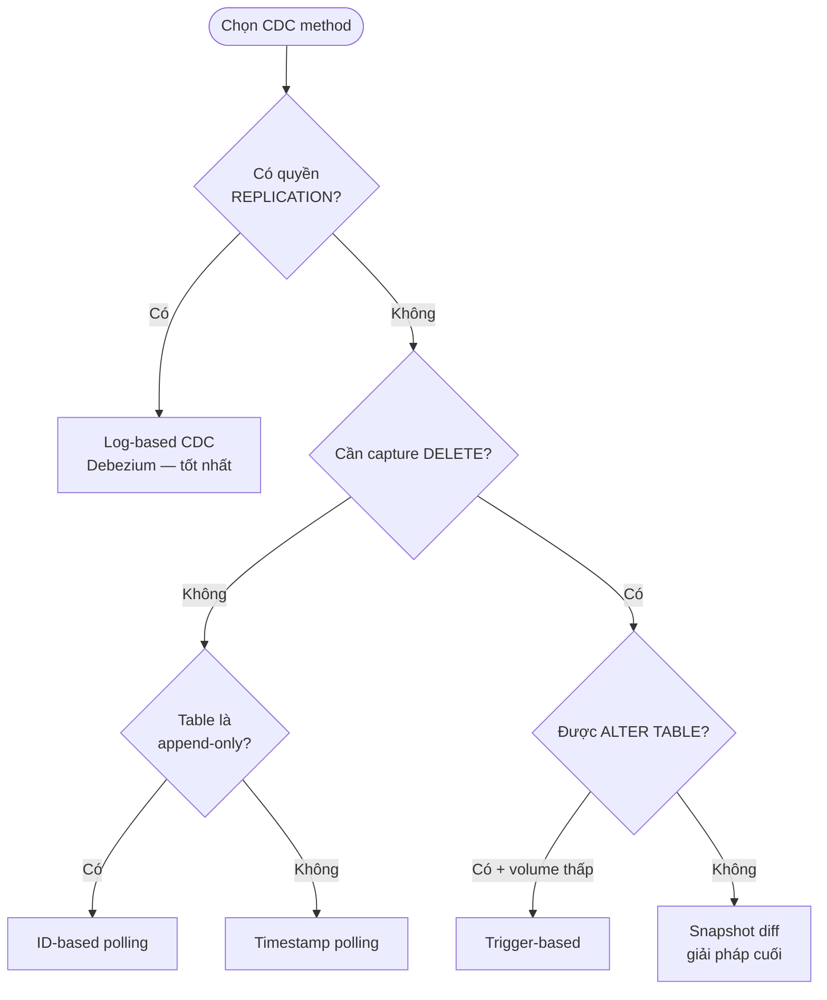

---

## 13. DB Engine → Kafka — 1 tỷ records

### 6 cách — tốt cho trường hợp nào

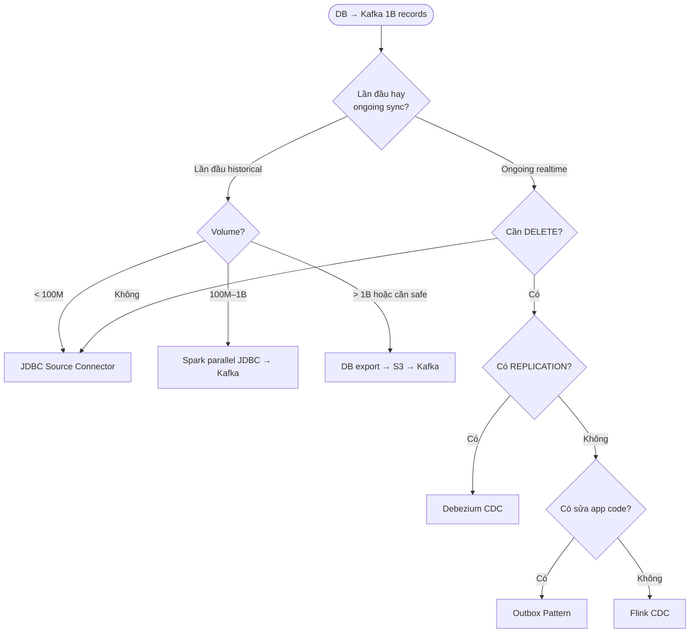

### Cách 1: JDBC Source Connector (Kafka Connect)

**Tốt cho:** Sync incremental hàng ngày, volume vừa (< 100M rows delta/ngày), team đã có Kafka Connect cluster.

**Ví dụ:** Airbyte dùng JDBC Connector để sync Salesforce PostgreSQL sang Kafka mỗi giờ. `tasks.max=5` → 5 worker đọc song song, mỗi worker poll 10K rows. Tổng ~50K rows/giây đủ cho 1M delta records trong 20 giây.

```json
{
  "connector.class": "io.confluent.connect.jdbc.JdbcSourceConnector",
  "connection.url": "jdbc:postgresql://prod-db:5432/shopee",
  "mode": "incrementing",
  "incrementing.column.name": "id",
  "batch.max.rows": "10000",
  "poll.interval.ms": "1000",
  "tasks.max": "5",
  "topic.prefix": "shopee."
}
```

**Không dùng khi:** Historical load 1 tỷ rows lần đầu — JDBC connector không partition-aware, đọc single thread, mất nhiều giờ.

### Cách 2: Debezium CDC Connector

**Tốt cho:** Ongoing realtime sync cần capture DELETE, latency sub-giây. Snapshot ban đầu kết hợp streaming.

**Ví dụ:** Grab cần sync `trips` table (10M trips/ngày, updates liên tục) từ MySQL vào Kafka cho downstream: Data Lake, Fraud Detection, Driver Scoring. Debezium snapshot 2B rows lịch sử (mất 6 giờ với incremental snapshot mode), sau đó streaming mode latency < 1 giây.

**Incremental snapshot mode (Debezium 2.0+) — tại sao quan trọng:**
```
Standard snapshot: SELECT * FROM trips (1 query, giữ REPEATABLE READ transaction 6 giờ)
→ MySQL WAL không được purge → disk đầy → production incident

Incremental snapshot: đọc 10K rows per chunk, xen kẽ với streaming
→ Không giữ transaction dài
→ Không block write operations
→ Dedup tự động với streaming events đang chạy song song
```

```yaml
snapshot.mode: initial
snapshot.fetch.size: 10240
incremental.snapshot.chunk.size: 10000
# Debezium tự dedup: nếu row vừa snapshot vừa có trong binlog stream
# → chỉ emit 1 lần, lấy version mới nhất từ binlog
```

### Cách 3: Spark parallel JDBC → Kafka

**Tốt cho:** Historical bulk load lần đầu, volume 100M–5B rows, có Spark cluster sẵn.

**Ví dụ:** Lazada merge 5 năm order history (2B rows) vào Unified Data Lake sau khi acquire công ty. Cần đưa vào Kafka để các team downstream (fraud, analytics, ML) consume theo tốc độ riêng.

```python
# Spark đọc 2B rows từ MySQL (200 partitions song song)
df = spark.read.jdbc(
    url="jdbc:mysql://lazada-mysql:3306/orders_archive",
    table="orders",
    column="id", lowerBound=0, upperBound=2_000_000_000,
    numPartitions=200,
    properties={"fetchsize": "50000"}
)

# Serialize Avro (3-5x nhỏ hơn JSON)
from pyspark.sql.avro.functions import to_avro

avro_df = df.select(
    col("id").cast("string").alias("key"),
    to_avro(struct("*"), avro_schema_json).alias("value")
)

# Ghi vào Kafka với throughput tối đa
avro_df.write.format("kafka") \
    .option("kafka.bootstrap.servers", "kafka:9092") \
    .option("topic", "lazada.orders.historical") \
    .option("kafka.batch.size", "1048576")       \  # 1MB batch
    .option("kafka.linger.ms", "100")            \  # đợi 100ms để gom batch
    .option("kafka.compression.type", "snappy")  \
    .option("kafka.acks", "1")                   \  # chỉ leader ack → nhanh hơn
    .save()

# Throughput đạt được: ~2M rows/giây → 2B rows mất ~17 phút
```

### Cách 4: DB export → S3 → Kafka

**Tốt cho:** Cần consistent snapshot, DB có connection limit thấp, pipeline phải resume được.

**Ví dụ:** VCB cần migrate customer transaction history vào Kafka cho Real-time Analytics platform. DB Oracle production không chịu được 200 Spark connections đồng thời. Giải pháp 2 phase:

```bash
# Phase 1: Oracle export ra S3 (1 connection duy nhất, tốc độ tối đa)
# Oracle Data Pump export
expdp vcb_reader/pass TABLES=transactions \
      DUMPFILE=transactions_%U.dmp PARALLEL=4 \
      DIRECTORY=EXPORT_DIR

# Upload lên S3
aws s3 cp transactions_01.dmp s3://vcb-migration/dump/
aws s3 cp transactions_02.dmp s3://vcb-migration/dump/

# Phase 2: Convert dump → Parquet → Kafka (không đụng Oracle)
```

```python
# Phase 2: Spark đọc từ S3, ghi Kafka — Oracle không bị touch
spark.read.parquet("s3://vcb-migration/transactions_parquet/") \
    .write.format("kafka") \
    .option("topic", "vcb.transactions.history") \
    .save()
```

**Tại sao tốt hơn Spark direct JDBC trong case này:**
- Oracle production: max 50 connections, không thể 200 parallel JDBC
- S3 làm checkpoint tự nhiên: nếu Kafka write fail → restart từ S3 file, không cần re-export Oracle
- DBA thoải mái hơn: 1 export session thay vì 200 connection đồng thời

### Cách 5: Outbox Pattern

**Tốt cho:** Microservices cần guaranteed event delivery, không muốn dual-write risk.

**Ví dụ:** MoMo transfer service — khi user chuyển tiền, cần đảm bảo event "transfer_completed" luôn được gửi lên Kafka, không bao giờ mất. Nếu Kafka down → transaction vẫn commit, event được gửi lại sau.

```python
# Application code: 1 transaction, không dual-write
with db.transaction():
    # Business operation
    db.execute("UPDATE accounts SET balance = balance - :amount WHERE id = :from_id",
               {"amount": 50000, "from_id": user_123})
    db.execute("UPDATE accounts SET balance = balance + :amount WHERE id = :to_id",
               {"amount": 50000, "to_id": user_456})
    # Ghi outbox trong cùng transaction
    db.execute("""
        INSERT INTO outbox (event_type, aggregate_id, payload)
        VALUES ('transfer.completed', :txn_id, :payload)
    """, {"txn_id": "TXN-789", "payload": json.dumps({...})})
    # Commit 1 lần: nếu fail → cả 3 operations rollback
    # Nếu thành công → outbox row đảm bảo sẽ được relay
```

```python
# Relay process (chạy song song)
while True:
    rows = db.execute("""
        SELECT * FROM outbox WHERE processed = FALSE
        ORDER BY id LIMIT 100 FOR UPDATE SKIP LOCKED
    """).fetchall()
    for row in rows:
        kafka_producer.produce(topic="momo.transfer", value=row.payload)
    kafka_producer.flush()
    db.execute("UPDATE outbox SET processed=TRUE WHERE id=ANY(%s)", ...)
```

**Không dùng khi:** Table > 10,000 events/giây — outbox table bottleneck. Dùng Kafka producer trực tiếp với idempotent producer mode.

### Cách 6: Flink CDC

**Tốt cho:** Cần transform/enrich/filter trước khi vào Kafka, đã có Flink trong stack.

**Ví dụ:** Be Group cần: đọc MySQL `trips` table → join với `drivers` table (enrichment) → filter chỉ lấy trip status = "completed" → tính thêm `revenue_after_promo` → ghi vào Kafka `be.completed_trips`. Làm tất cả trong Flink pipeline, không cần consumer riêng.

```sql
-- Flink SQL
CREATE TABLE trips_source (...) WITH (
    'connector' = 'mysql-cdc',
    'hostname' = 'be-mysql:3306',
    'database-name' = 'be_app',
    'table-name' = 'trips',
    'scan.startup.mode' = 'initial'
);

CREATE TABLE drivers_dim (...) WITH (
    'connector' = 'jdbc',
    'url' = 'jdbc:mysql://be-mysql:3306/be_app',
    'table-name' = 'drivers'
);

CREATE TABLE completed_trips_kafka (...) WITH (
    'connector' = 'kafka',
    'topic' = 'be.completed_trips',
    'format' = 'json'
);

-- Pipeline: CDC + enrichment + filter → Kafka
INSERT INTO completed_trips_kafka
SELECT t.trip_id, t.driver_id, d.name,
       t.fare - COALESCE(t.promo_amount, 0) AS revenue_after_promo
FROM trips_source t
LEFT JOIN drivers_dim d ON t.driver_id = d.id
WHERE t.status = 'completed';
```

### Kafka producer config tối ưu cho throughput cao

```python
producer = Producer({
    "bootstrap.servers": "kafka-1:9092,kafka-2:9092,kafka-3:9092",
    # Batching — quan trọng nhất
    "batch.size": 1_048_576,           # 1MB (default 16KB — quá nhỏ!)
    "linger.ms": 100,                  # đợi 100ms để gom batch lớn hơn
    "queue.buffering.max.messages": 2_000_000,
    # Compression
    "compression.type": "snappy",      # speed > ratio, phù hợp bulk load
    # "compression.type": "zstd",      # ratio tốt hơn nếu network là bottleneck
    # Reliability
    "acks": "1",                       # chỉ leader ack → throughput cao hơn "all"
    "retries": 10,
    "retry.backoff.ms": 500,
})
```

**Tại sao `batch.size=1MB` thay vì default 16KB?**
- Default: 16KB batch → 1B rows × 500 bytes/row = 500GB / 16KB = 32.5M Kafka requests
- 1MB batch: 500GB / 1MB = 500K requests → 65x ít network round-trip hơn
- Throughput tăng từ ~50K rows/giây → ~2M rows/giây

### So sánh 6 cách

| Cách | Throughput | Latency | Setup | DB Load | Tốt nhất khi |
|---|---|---|---|---|---|
| JDBC Connector | Trung bình | Giây | Đơn giản | Trung bình | Incremental hàng ngày < 100M |
| Debezium CDC | Cao | Sub-giây | Trung bình | ~0 | Realtime ongoing + DELETE |
| Spark → Kafka | Rất cao | Phút | Phức tạp | Cao | Historical bulk 100M–5B lần đầu |
| Export → S3 → Kafka | Cao | Phút–Giờ | Trung bình | Thấp | DB ít connection, cần checkpoint |
| Outbox Pattern | Thấp–TB | Sub-giây | Cao | Thấp | Microservices guaranteed delivery |
| Flink CDC | Cao | Sub-giây | Cao | ~0 | Cần transform/enrich trước Kafka |

---

## 14. Glossary

| Thuật ngữ | Định nghĩa | Ví dụ |
|---|---|---|
| Schema-on-write | Validate cấu trúc khi GHI | Redshift reject row sai kiểu dữ liệu |
| Schema-on-read | Áp cấu trúc khi ĐỌC | Spark infer schema JSON khi query |
| CDC | Change Data Capture — bắt delta từ DB | Debezium đọc MySQL binlog |
| WAL | Write-Ahead Log của PostgreSQL | pg_wal/ directory |
| Binlog | Binary Log của MySQL | mysql-bin.000001 |
| LSN | Log Sequence Number — vị trí trong WAL | Resume CDC sau fail |
| GTID | Global Transaction ID của MySQL | Alternate resume mechanism |
| Replication slot | PostgreSQL giữ WAL cho CDC consumer | Phải monitor để tránh disk đầy |
| Idempotency | Áp event 2 lần → kết quả không đổi | INSERT ON CONFLICT DO UPDATE |
| Predicate pushdown | Filter đẩy xuống file reader | Spark skip Parquet row group |
| Column pruning | Chỉ đọc cột cần thiết | Parquet đọc 2/50 cột |
| Lakehouse | Lake + Warehouse trong một | Delta Lake, Apache Iceberg |
| Keyset pagination | WHERE id > last_id thay vì OFFSET | Tránh full scan khi phân trang |
| At-least-once | Không mất event, có thể duplicate | Kafka default consumer |
| Exactly-once | Không mất, không duplicate | Kafka Transactions + idempotent |
| Partition skew | Data phân bổ không đều | 90% rows trong 1 partition |
| Small files problem | Nhiều file nhỏ trên S3 | 1M files × 1KB vs 1K files × 1MB |
| Outbox pattern | Ghi event vào DB trong cùng transaction | Guarantee không mất Kafka event |
| Scatter-gather | Fan-out query, gom kết quả | Query 8 shard song song |
| Incremental snapshot | Debezium snapshot không lock table | Chạy song song với streaming |
| Watermark | Mốc đánh dấu "đã đọc đến đây" | updated_at hoặc last_id |
| Fan-out | Một source → nhiều consumer | CDC event → ES + BigQuery + Redis |
| Dead Letter Queue | Hàng đợi lưu event xử lý thất bại | Kafka topic `.DLQ` suffix |

---

## 15. Ingestion — File & Batch

File ingestion và batch ingestion là hai pattern phổ biến nhất nhưng thường bị xử lý sơ sài. Phần này đi sâu vào từng loại file source, các vấn đề thực tế và cách xử lý đúng.

### Toàn cảnh file & batch ingestion

```mermaid
flowchart TD
    subgraph SOURCES["File Sources"]
        F1[SFTP / FTP Server\nPartner gửi CSV/Excel hàng ngày]
        F2[S3 / GCS / ADLS\nFile drop từ upstream system]
        F3[Email attachment\nBáo cáo từ ERP/SAP]
        F4[HTTP download\nPublic dataset, gov open data]
        F5[Shared network drive\nLegacy on-premise export]
    end

    subgraph DETECT["Phát hiện file mới"]
        D1[S3 Event Notification\nTrigger Lambda khi có file mới]
        D2[SFTP polling\nList directory mỗi N phút]
        D3[File watcher\ninotify / watchdog]
        D4[Manifest file\nupstream ghi danh sách file xong]
    end

    subgraph VALIDATE["Validate trước khi xử lý"]
        V1[Checksum MD5/SHA256\nđảm bảo file không corrupt]
        V2[Schema validation\nheader đúng không?]
        V3[Row count check\nkhớp với file metadata?]
        V4[Encoding detect\nUTF-8 / UTF-16 / Windows-1252]
        V5[Delimiter detect\ncomma / tab / pipe / semicolon]
    end

    subgraph PARSE["Parse & Normalize"]
        P1[CSV / TSV / PSV]
        P2[Excel .xlsx / .xls]
        P3[JSON / NDJSON]
        P4[XML / EDI]
        P5[Parquet / ORC / Avro]
        P6[Fixed-width / Positional]
    end

    subgraph SINK["Load vào destination"]
        S1[Stage → Transform → Load]
        S2[Ghi Parquet vào Data Lake]
        S3[Upsert vào Data Warehouse]
    end

    SOURCES --> DETECT --> VALIDATE --> PARSE --> SINK
```

---

### 15.1 Phát hiện file mới — 4 cách

#### S3 Event Notification + SQS/Lambda
**Tốt cho:** File drop vào S3, cần xử lý ngay trong vài giây.

**Ví dụ:** Tiki nhận file đơn hàng từ seller partner qua S3. Seller upload `orders_20240115.csv` → S3 emit event → SQS queue → Lambda trigger Airflow DAG.
```json
// S3 Event notification
{
  "Records": [{
    "s3": {
      "bucket": {"name": "tiki-partner-inbox"},
      "object": {"key": "seller_123/orders_20240115.csv", "size": 52428800}
    }
  }]
}
```
```python
# Lambda handler
def handler(event, context):
    for record in event["Records"]:
        bucket = record["s3"]["bucket"]["name"]
        key    = record["s3"]["object"]["key"]
        # Trigger Airflow DAG với params
        airflow_client.trigger_dag(
            dag_id="process_seller_file",
            conf={"bucket": bucket, "key": key}
        )
```

#### SFTP polling
**Tốt cho:** Legacy partner chỉ có SFTP, không thể push lên S3.

**Ví dụ:** Ngân hàng đối tác gửi file settlement qua SFTP lúc 6am mỗi ngày. Airflow sensor poll SFTP mỗi 5 phút từ 5am.
```python
# Airflow SFTPSensor
from airflow.providers.sftp.sensors.sftp import SFTPSensor

wait_for_file = SFTPSensor(
    task_id="wait_settlement_file",
    sftp_conn_id="bank_sftp",
    path="/outgoing/settlement_{{ ds }}.csv",
    poke_interval=300,       # poll mỗi 5 phút
    timeout=7200,            # timeout sau 2 giờ
    mode="reschedule",       # nhả worker slot khi đang chờ
)
```

#### Manifest file pattern
**Tốt cho:** Upstream system ghi nhiều file song song, cần đợi tất cả xong mới process.

**Ví dụ:** Grab data platform export GPS data thành 100 file song song, ghi file `_SUCCESS` khi tất cả xong. Pipeline chỉ process khi thấy `_SUCCESS`.
```python
# Check manifest trước khi process
def check_ready(s3, bucket, prefix, date):
    # Đợi file _SUCCESS — dấu hiệu upstream đã ghi xong tất cả
    try:
        s3.head_object(Bucket=bucket, Key=f"{prefix}/date={date}/_SUCCESS")
        return True
    except s3.exceptions.ClientError:
        return False  # Chưa xong, retry sau
```

#### inotify / File watcher
**Tốt cho:** On-premise, NFS mount, file system local.

```python
from watchdog.observers import Observer
from watchdog.events import FileSystemEventHandler

class FileHandler(FileSystemEventHandler):
    def on_created(self, event):
        if event.src_path.endswith(".csv"):
            process_file(event.src_path)

observer = Observer()
observer.schedule(FileHandler(), path="/data/incoming/", recursive=False)
observer.start()
```

---

### 15.2 Validate file trước khi xử lý

**Tại sao quan trọng:** File corrupt hoặc sai schema đưa vào pipeline sẽ gây lỗi ở tầng sau, khó debug hơn nhiều so với validate sớm.

```python
import hashlib, chardet, csv
from pathlib import Path

def validate_file(filepath: str, expected_checksum: str = None) -> dict:
    result = {"valid": True, "errors": []}
    path = Path(filepath)

    # 1. File tồn tại và không rỗng
    if not path.exists() or path.stat().st_size == 0:
        result["errors"].append("File missing or empty")
        result["valid"] = False
        return result

    # 2. Checksum (nếu partner gửi kèm .md5 file)
    if expected_checksum:
        actual = hashlib.md5(path.read_bytes()).hexdigest()
        if actual != expected_checksum:
            result["errors"].append(f"Checksum mismatch: {actual} != {expected_checksum}")
            result["valid"] = False

    # 3. Encoding detection
    raw = path.read_bytes()[:10000]   # sample 10KB
    detected = chardet.detect(raw)
    result["encoding"] = detected["encoding"]
    if detected["confidence"] < 0.8:
        result["errors"].append(f"Encoding uncertain: {detected}")

    # 4. Schema check (header row)
    EXPECTED_HEADERS = {"order_id", "amount", "status", "created_at"}
    with open(filepath, encoding=result["encoding"]) as f:
        reader = csv.DictReader(f)
        actual_headers = set(reader.fieldnames or [])
        missing = EXPECTED_HEADERS - actual_headers
        if missing:
            result["errors"].append(f"Missing columns: {missing}")
            result["valid"] = False

    # 5. Row count vs manifest
    row_count = sum(1 for _ in open(filepath)) - 1  # exclude header
    result["row_count"] = row_count

    return result
```

---

### 15.3 Parse từng loại file — ví dụ thực tế

#### CSV / TSV — vấn đề thường gặp

**Ví dụ thực tế:** VinCommerce nhận file báo cáo tồn kho từ WMS (Warehouse Management System). File CSV 500MB, 5 triệu dòng, encoding Windows-1252 (vì vendor dùng Windows), delimiter là dấu `;` không phải `,`.

```python
import pandas as pd

# KHÔNG làm thế này với file lớn — OOM với 500MB
# df = pd.read_csv("inventory.csv")

# LÀM thế này — đọc theo chunk, xử lý từng phần
CHUNK_SIZE = 100_000

for chunk in pd.read_csv(
    "inventory.csv",
    sep=";",                          # delimiter thực tế
    encoding="windows-1252",          # encoding của vendor
    dtype={"sku_code": str,           # ép kiểu sớm tránh mixed type
           "barcode": str},
    parse_dates=["export_date"],
    chunksize=CHUNK_SIZE,
    on_bad_lines="warn",              # log row lỗi, không crash
    engine="python",                  # engine linh hoạt hơn cho edge case
):
    # Process từng chunk rồi ghi Parquet
    chunk_clean = clean_and_transform(chunk)
    chunk_clean.to_parquet(
        f"s3://vincommerce-lake/inventory/part_{chunk_idx:04d}.parquet",
        compression="snappy",
        index=False
    )
    chunk_idx += 1
```

**Vấn đề hay gặp với CSV:**
```
1. Newline trong field: "địa chỉ: 12\nNguyễn Huệ" → phá vỡ row boundary
   Fix: quotechar='"', quoting=csv.QUOTE_ALL

2. Số thập phân: "1.234,56" (European) vs "1,234.56" (US)
   Fix: thousands='.', decimal=','

3. Date format: "15/01/2024" vs "2024-01-15" vs "Jan 15, 2024"
   Fix: parse_dates + dayfirst=True hoặc format='%d/%m/%Y'

4. BOM (Byte Order Mark): file UTF-8 with BOM → \ufeff ở đầu column name
   Fix: encoding="utf-8-sig"
```

#### Excel .xlsx — ví dụ thực tế

**Ví dụ:** Kế toán VPBank gửi báo cáo tài chính dạng Excel có merged cells, header nhiều dòng, và nhiều sheet.

```python
import openpyxl
import pandas as pd

def read_bank_report(filepath: str) -> pd.DataFrame:
    wb = openpyxl.load_workbook(filepath, read_only=True, data_only=True)

    # Chọn đúng sheet
    ws = wb["Báo cáo tháng"]

    # Skip header phức tạp (5 dòng đầu là title/metadata)
    rows = list(ws.iter_rows(min_row=6, values_only=True))
    df = pd.DataFrame(rows, columns=["date", "account", "debit", "credit", "balance"])

    # Xử lý merged cells (giá trị None kế thừa từ cell trên)
    df["date"] = df["date"].ffill()          # forward fill merged date cells
    df["account"] = df["account"].ffill()

    # Xử lý số tiền dạng string "1,234,567"
    for col in ["debit", "credit", "balance"]:
        df[col] = df[col].astype(str).str.replace(",", "").astype(float)

    wb.close()
    return df.dropna(subset=["balance"])
```

#### JSON / NDJSON — ví dụ thực tế

**Ví dụ:** TikTok Vietnam nhận event từ app dạng NDJSON (Newline Delimited JSON) — mỗi dòng là 1 JSON object độc lập, không phải JSON array. File 10GB.

```python
# NDJSON đọc hiệu quả với pandas
import pandas as pd

# Nếu file < 2GB RAM: đọc thẳng
df = pd.read_json("events.ndjson", lines=True)

# Nếu file lớn: Spark đọc song song (NDJSON là row-splittable)
df = spark.read.json("s3://tiktok-events/raw/2024/01/15/*.ndjson")

# Vấn đề: nested JSON
# {"user_id": 123, "event": {"type": "view", "video": {"id": "abc", "duration": 30}}}
df_flat = df.select(
    "user_id",
    "event.type",
    "event.video.id",
    "event.video.duration"
)
```

#### XML / EDI — ví dụ thực tế

**Ví dụ:** Chuỗi siêu thị nhận file EDI X12 từ nhà cung cấp (chuẩn thương mại điện tử B2B).

```python
import xml.etree.ElementTree as ET

def parse_purchase_order_xml(filepath: str) -> list:
    tree = ET.parse(filepath)
    root = tree.getroot()
    ns = {"edi": "http://www.w3c.org/edi/schema"}  # namespace

    orders = []
    for po in root.findall("edi:PurchaseOrder", ns):
        order = {
            "po_number": po.findtext("edi:PONumber", namespaces=ns),
            "vendor_id": po.findtext("edi:VendorID", namespaces=ns),
            "items": [
                {
                    "sku": item.findtext("edi:SKU", namespaces=ns),
                    "qty": int(item.findtext("edi:Quantity", namespaces=ns)),
                    "price": float(item.findtext("edi:UnitPrice", namespaces=ns)),
                }
                for item in po.findall("edi:LineItem", ns)
            ]
        }
        orders.append(order)
    return orders
```

#### Fixed-width / Positional — ví dụ thực tế

**Ví dụ:** Core banking legacy xuất file giao dịch dạng fixed-width — mỗi field có vị trí byte cố định, không có delimiter.

```
00012345678901234562024011500000010000000NGUYEN VAN AN          CR
00098765432112345672024011500000050000000TRAN THI B             DR
```

```python
import pandas as pd

# Định nghĩa layout: (tên, start, end, dtype)
LAYOUT = [
    ("txn_id",      0,  10, str),
    ("account_no", 10,  22, str),
    ("date",       22,  30, str),
    ("amount",     30,  45, float),
    ("name",       45,  70, str),
    ("type",       70,  72, str),   # CR = credit, DR = debit
]

def parse_fixed_width(filepath: str) -> pd.DataFrame:
    records = []
    with open(filepath, encoding="utf-8") as f:
        for line in f:
            if len(line.rstrip("\n")) < 72:
                continue  # skip incomplete lines
            record = {}
            for field_name, start, end, dtype in LAYOUT:
                raw = line[start:end].strip()
                try:
                    record[field_name] = dtype(raw) if raw else None
                except ValueError:
                    record[field_name] = None
            records.append(record)
    return pd.DataFrame(records)
```

---

### 15.4 Batch ingestion patterns — đầy đủ

#### Full load (snapshot)
**Tốt cho:** Table nhỏ (< 10M rows), reference data, dimension table thay đổi ít.

**Ví dụ:** Danh mục sản phẩm Tiki (2M sản phẩm) load lại hoàn toàn mỗi đêm vì không có CDC và cần đảm bảo nhất quán.

```python
# Airflow DAG: Full load với TRUNCATE + INSERT
@dag(schedule="0 2 * * *")  # 2am mỗi ngày
def full_load_products():

    @task
    def extract():
        df = spark.read.jdbc(url=jdbc_url, table="products", ...)
        df.write.mode("overwrite").parquet("s3://staging/products/")
        return df.count()

    @task
    def load(row_count):
        bq_client.query("""
            TRUNCATE TABLE tiki_dw.products;
            INSERT INTO tiki_dw.products
            SELECT * FROM staging.products_external;
        """).result()
        return row_count
```

#### Incremental append
**Tốt cho:** Event log, fact table, append-only data.

**Ví dụ:** Grab load trip data hàng ngày — chỉ thêm trips của ngày hôm qua, không bao giờ sửa trips cũ.

```python
@dag(schedule="0 3 * * *")
def incremental_append_trips():

    @task
    def extract(ds):  # ds = execution date "2024-01-15"
        df = spark.read.jdbc(
            url=jdbc_url,
            table=f"(SELECT * FROM trips WHERE DATE(end_time) = '{ds}') t",
            numPartitions=20,
            column="trip_id", lowerBound=0, upperBound=max_id,
        )
        df.write.parquet(f"s3://grab-lake/trips/date={ds}/")

    @task
    def load(ds):
        bq_client.query(f"""
            INSERT INTO grab_dw.trips
            SELECT * FROM grab_staging.trips_ext
            WHERE date = '{ds}'
        """).result()
```

#### Incremental upsert (SCD Type 1)
**Tốt cho:** Table có UPDATE, cần phản ánh trạng thái mới nhất, không quan tâm lịch sử.

**Ví dụ:** Order status table — order có thể UPDATE nhiều lần (pending→confirmed→shipped→delivered).

```python
@task
def upsert_orders(ds):
    # Lấy tất cả orders thay đổi trong 24h qua
    df = spark.read.jdbc(
        url=jdbc_url,
        table=f"(SELECT * FROM orders WHERE updated_at >= '{ds}' - INTERVAL 1 DAY) t",
        ...
    )
    df.write.parquet(f"s3://staging/orders_delta/{ds}/")

    # BigQuery MERGE (upsert)
    bq_client.query(f"""
        MERGE INTO shopee_dw.orders T
        USING (SELECT * FROM shopee_staging.orders_delta WHERE dt='{ds}') S
        ON T.order_id = S.order_id
        WHEN MATCHED THEN UPDATE SET
            T.status     = S.status,
            T.updated_at = S.updated_at
        WHEN NOT MATCHED THEN INSERT VALUES (S.*)
    """).result()
```

#### SCD Type 2 (Slowly Changing Dimension)
**Tốt cho:** Cần giữ lịch sử thay đổi — user đổi địa chỉ, product đổi giá.

**Ví dụ:** Lazada cần biết user lúc mua hàng đang ở địa chỉ nào (không phải địa chỉ hiện tại).

```python
@task
def scd2_users(ds):
    bq_client.query(f"""
        -- Đóng records cũ
        UPDATE lazada_dw.dim_users
        SET valid_to = '{ds}', is_current = FALSE
        WHERE user_id IN (
            SELECT user_id FROM lazada_staging.users_changed WHERE dt = '{ds}'
        ) AND is_current = TRUE;

        -- Insert records mới
        INSERT INTO lazada_dw.dim_users
        SELECT
            user_id,
            address,
            phone,
            '{ds}'        AS valid_from,
            '9999-12-31'  AS valid_to,
            TRUE          AS is_current
        FROM lazada_staging.users_changed
        WHERE dt = '{ds}';
    """).result()
```

---

### 15.5 File ingestion anti-patterns

```
❌ Đọc toàn bộ file vào RAM
   pd.read_csv("500MB.csv") trên máy 512MB RAM → OOM crash
   Fix: chunksize=100_000

❌ Process file chưa validate xong
   File corrupt ở row 4,999,999 → job chết sau 2 giờ
   Fix: validate checksum + schema TRƯỚC khi process

❌ Không idempotent — chạy lại bị duplicate
   Rerun DAG khi file đã được load → duplicate data
   Fix: TRUNCATE partition trước INSERT, hoặc dùng MERGE

❌ Không handle encoding
   File Windows-1252 đọc như UTF-8 → ký tự tiếng Việt bị lỗi
   Fix: chardet detect encoding trước khi đọc

❌ Assume delimiter là comma
   File thực tế dùng pipe | hoặc semicolon ;
   Fix: sniff delimiter từ vài dòng đầu

❌ Không có audit trail
   File đã được process chưa? Process lần nào? Bao nhiêu rows?
   Fix: ghi metadata vào tracking table sau mỗi file
```

---

## 16. Processing

Sau khi data được ingest vào staging area (Raw zone của Lake hoặc staging table của Warehouse), bước Processing transform data thành dạng có thể dùng được.

### Toàn cảnh processing pipeline

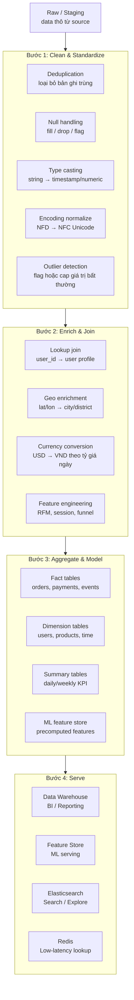

### 16.1 Deduplication — ví dụ thực tế

**Vấn đề:** Kafka at-least-once delivery → cùng event có thể được consume 2 lần. Hoặc file partner gửi trùng do retry.

**Ví dụ:** MoMo nhận payment event từ Kafka, có thể duplicate do producer retry.

```python
# Spark: dedup bằng window function
from pyspark.sql import functions as F
from pyspark.sql.window import Window

df_deduped = df.withColumn(
    "rn",
    F.row_number().over(
        Window.partitionBy("event_id")          # unique event identifier
              .orderBy(F.desc("received_at"))   # giữ bản ghi mới nhất
    )
).filter(F.col("rn") == 1).drop("rn")

# SQL: dedup với QUALIFY (BigQuery / Snowflake)
"""
SELECT * EXCEPT(rn)
FROM (
    SELECT *,
           ROW_NUMBER() OVER (PARTITION BY event_id ORDER BY received_at DESC) rn
    FROM raw.payment_events
)
WHERE rn = 1
"""
```

**Ví dụ 2: Dedup file partner trùng**
```python
# Tracking table: đã process file nào rồi
CREATE TABLE file_processing_log (
    file_name     VARCHAR(500) PRIMARY KEY,
    checksum      VARCHAR(64),
    processed_at  TIMESTAMP,
    row_count     INT,
    status        VARCHAR(20)   -- 'success' / 'failed'
);

# Trước khi process: check xem file đã xử lý chưa
def is_already_processed(file_name: str, checksum: str) -> bool:
    row = db.execute(
        "SELECT status FROM file_processing_log WHERE file_name=%s AND checksum=%s",
        (file_name, checksum)
    ).fetchone()
    return row and row["status"] == "success"
```

### 16.2 Null handling — các chiến lược

```python
import pandas as pd

df = pd.read_parquet("s3://lake/orders/raw/")

# Chiến lược 1: DROP — dùng khi null không có nghĩa
# Ví dụ: order không có user_id → không thể link với user → drop
df = df.dropna(subset=["user_id", "order_id"])  # required fields

# Chiến lược 2: FILL — dùng khi có giá trị mặc định hợp lý
# Ví dụ: promo_discount null = 0 (không có khuyến mãi)
df["promo_discount"] = df["promo_discount"].fillna(0)
df["city"] = df["city"].fillna("Unknown")

# Chiến lược 3: FLAG — dùng khi null có ý nghĩa business
# Ví dụ: phone null = user chưa verify phone → cần flag riêng
df["has_phone"] = df["phone"].notna()

# Chiến lược 4: IMPUTE — dùng cho ML features
# Ví dụ: age null → fill bằng median age của nhóm tương tự
median_age = df.groupby("city")["age"].transform("median")
df["age"] = df["age"].fillna(median_age)
```

### 16.3 Type casting và normalize — ví dụ thực tế

**Ví dụ:** Zalopay nhận transaction data từ nhiều nguồn, mỗi nguồn format khác nhau.

```python
from datetime import datetime
import re

def normalize_transaction(row: dict) -> dict:
    # 1. Timestamp: nhiều format khác nhau
    raw_ts = row.get("created_at", "")
    for fmt in ["%Y-%m-%dT%H:%M:%SZ",    # ISO 8601
                "%d/%m/%Y %H:%M:%S",      # VN format
                "%Y%m%d%H%M%S"]:          # compact
        try:
            row["created_at"] = datetime.strptime(raw_ts, fmt)
            break
        except ValueError:
            continue

    # 2. Amount: loại bỏ ký tự tiền tệ, convert về float
    # "1.234.567 ₫" → 1234567.0
    raw_amount = str(row.get("amount", "0"))
    row["amount"] = float(re.sub(r"[^\d.]", "", raw_amount.replace(",", ".")))

    # 3. Phone normalize: nhiều format → chuẩn E.164
    phone = re.sub(r"\D", "", str(row.get("phone", "")))
    if phone.startswith("0"):
        phone = "84" + phone[1:]   # 0912345678 → 84912345678
    row["phone"] = "+" + phone if len(phone) == 11 else None

    # 4. Name: normalize Unicode (tránh "Nguyễn" dạng NFD vs NFC)
    import unicodedata
    row["name"] = unicodedata.normalize("NFC", row.get("name", ""))

    return row
```

### 16.4 Enrichment — ví dụ thực tế

**Ví dụ 1: Geo enrichment — Grab**
```python
# Broadcast join: lookup table nhỏ broadcast tới mọi Spark executor
# Không cần shuffle toàn bộ data
from pyspark.sql.functions import broadcast

city_mapping = spark.read.parquet("s3://grab-lake/dim/city_polygons/")

trips_enriched = trips.join(
    broadcast(city_mapping),
    # PostGIS-style: tìm city chứa điểm pickup
    trips.pickup_lat.between(city_mapping.lat_min, city_mapping.lat_max) &
    trips.pickup_lon.between(city_mapping.lon_min, city_mapping.lon_max),
    how="left"
).select("trip_id", "driver_id", "pickup_city", "fare")
```

**Ví dụ 2: Currency conversion — Lazada multi-country**
```python
# Exchange rate lookup theo ngày
@task
def enrich_with_fx(ds: str):
    # Load FX rates của ngày đó
    fx = spark.read.parquet(f"s3://lazada-lake/dim/fx_rates/date={ds}/")
    # {currency: "USD", rate_to_vnd: 24350.0, date: "2024-01-15"}

    orders = spark.read.parquet(f"s3://lazada-lake/orders/date={ds}/")

    orders_vnd = orders.join(fx, on=["currency", "date"], how="left") \
        .withColumn("amount_vnd", col("amount") * col("rate_to_vnd"))
```

### 16.5 Data modeling — Star schema

**Ví dụ:** Tiki xây dựng Star schema trong BigQuery cho BI reporting.

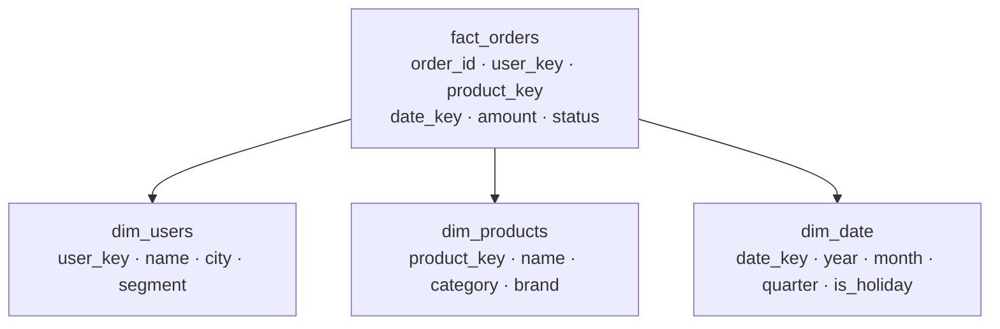

```sql
-- dbt model: fact_orders.sql
WITH source AS (
    SELECT * FROM {{ ref('stg_orders') }}
),
users AS (SELECT * FROM {{ ref('dim_users') }}),
products AS (SELECT * FROM {{ ref('dim_products') }}),
dates AS (SELECT * FROM {{ ref('dim_date') }})

SELECT
    o.order_id,
    u.user_key,
    p.product_key,
    d.date_key,
    o.amount,
    o.status,
    o.created_at
FROM source o
LEFT JOIN users    u ON o.user_id    = u.user_id
LEFT JOIN products p ON o.product_id = p.product_id
LEFT JOIN dates    d ON DATE(o.created_at) = d.date
```

### 16.6 Tools xử lý data

| Tool | Tốt cho | Ví dụ thực tế |
|---|---|---|
| **Apache Spark** | Distributed transform, > 1TB data | Grab: process 50TB GPS data/ngày |
| **dbt** | SQL-based transform, DWH modeling, lineage | Tiki: 200 dbt model trong BigQuery |
| **Apache Flink** | Streaming transform, stateful, low-latency | MoMo: fraud detection < 500ms |
| **Pandas** | File processing nhỏ, < 1GB, exploratory | Kế toán: process Excel report |
| **Polars** | Pandas alternative, nhanh hơn 5-10x, multi-core | Replace pandas cho file 1–10GB |
| **DuckDB** | SQL analytics on local file, Parquet/CSV | Analyst: query S3 file không cần cluster |
| **Apache Beam** | Unified batch + streaming, portable | Google Cloud Dataflow backend |

---

## 17. Orchestration

Orchestration là lớp điều phối toàn bộ pipeline — quyết định task nào chạy lúc nào, theo thứ tự nào, retry khi nào, alert ai khi fail.

### Toàn cảnh orchestration

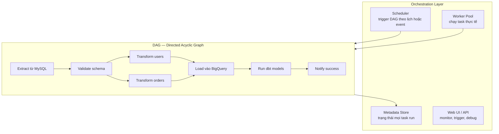

### 17.1 Apache Airflow — ví dụ thực tế

**Tốt cho:** Complex pipeline nhiều step, dependency rõ ràng, team data engineering lớn.

**Ví dụ:** Tiki daily pipeline — ingest từ 5 nguồn, transform, load vào BigQuery, chạy dbt.

```python
from airflow.decorators import dag, task
from airflow.providers.google.cloud.operators.bigquery import BigQueryInsertJobOperator
from airflow.providers.dbt.cloud.operators.dbt import DbtCloudRunJobOperator
from datetime import datetime, timedelta

@dag(
    schedule="0 2 * * *",   # 2am mỗi ngày
    start_date=datetime(2024, 1, 1),
    catchup=False,
    default_args={
        "retries": 3,
        "retry_delay": timedelta(minutes=5),
        "on_failure_callback": notify_slack,  # alert Slack khi fail
    },
    tags=["daily", "core"],
)
def tiki_daily_pipeline():

    @task
    def extract_orders(ds):
        """Đọc orders từ MySQL, ghi Parquet ra GCS"""
        df = spark_submit("jobs/extract_orders.py", date=ds)
        return df.count()

    @task
    def extract_products(ds):
        """Full load products catalog"""
        return spark_submit("jobs/extract_products.py", date=ds)

    @task
    def validate_orders(row_count, ds):
        """Đảm bảo số lượng orders hợp lý"""
        if row_count < 10_000:
            raise ValueError(f"Too few orders: {row_count} on {ds}")
        # Check vs yesterday ± 30%
        yesterday_count = get_yesterday_count("orders", ds)
        if abs(row_count - yesterday_count) / yesterday_count > 0.3:
            send_alert(f"Order count anomaly: {row_count} vs {yesterday_count}")

    load_to_bq = BigQueryInsertJobOperator(
        task_id="load_to_bigquery",
        configuration={
            "load": {
                "sourceUris": ["gs://tiki-staging/orders/{{ ds }}/*.parquet"],
                "destinationTable": {"projectId": "tiki-dw", "datasetId": "staging", "tableId": "orders"},
                "sourceFormat": "PARQUET",
                "writeDisposition": "WRITE_TRUNCATE",
            }
        }
    )

    run_dbt = DbtCloudRunJobOperator(
        task_id="run_dbt_models",
        job_id=12345,
        wait_for_termination=True,
    )

    # Dependency graph
    orders_count = extract_orders()
    products_count = extract_products()
    validated = validate_orders(orders_count)
    validated >> load_to_bq >> run_dbt

tiki_daily_pipeline()
```

**Airflow tốt nhất khi:**
- Pipeline phức tạp, nhiều dependency
- Cần retry granular per-task
- Cần backfill historical data (`catchup=True`)
- Team lớn, cần RBAC, audit trail

**Airflow không phù hợp khi:**
- Task chạy sub-minute (Airflow overhead ~5 giây/task)
- Dynamic pipeline thay đổi structure lúc runtime
- Team nhỏ không muốn maintain Airflow infra

### 17.2 Prefect — ví dụ thực tế

**Tốt cho:** Python-first, deploy linh hoạt, dynamic pipeline.

**Ví dụ:** Be Group dùng Prefect cho ML pipeline — số lượng task thay đổi theo ngày.

```python
from prefect import flow, task
from prefect.task_runners import ConcurrentTaskRunner

@task(retries=3, retry_delay_seconds=60)
def extract_trips(date: str, city: str) -> int:
    df = spark.read.jdbc(...)
    df.write.parquet(f"s3://be-lake/trips/date={date}/city={city}/")
    return df.count()

@task
def validate(count: int, city: str):
    if count == 0:
        raise ValueError(f"No trips for {city}")

@flow(task_runner=ConcurrentTaskRunner())
def daily_trip_pipeline(date: str):
    cities = get_active_cities(date)  # dynamic — số city thay đổi mỗi ngày

    # Chạy song song cho tất cả city
    counts = extract_trips.map(date=date, city=cities)
    validate.map(count=counts, city=cities)

# Deploy
from prefect.deployments import Deployment
Deployment.build_from_flow(
    flow=daily_trip_pipeline,
    name="daily-trips",
    cron="0 3 * * *",
)
```

### 17.3 dbt — orchestration cho transformation layer

**Tốt cho:** SQL-based transformation, lineage tracking, data testing tích hợp.

**Ví dụ:** Shopee dùng dbt để manage 500 SQL model trong BigQuery.

```yaml
# dbt_project.yml
models:
  shopee:
    staging:       # tầng 1: raw → clean
      +materialized: view
    intermediate:  # tầng 2: business logic
      +materialized: ephemeral
    marts:         # tầng 3: serve cho BI
      +materialized: table
      +post-hook: "GRANT SELECT ON {{ this }} TO ROLE bi_reader"
```

```sql
-- models/staging/stg_orders.sql
-- Tầng staging: chỉ rename, cast type, basic clean
SELECT
    order_id,
    user_id,
    CAST(amount AS NUMERIC)                           AS amount,
    PARSE_TIMESTAMP('%Y-%m-%dT%H:%M:%SZ', created_at) AS created_at,
    LOWER(status)                                     AS status
FROM {{ source('mysql_raw', 'orders') }}
WHERE order_id IS NOT NULL

-- models/marts/fct_orders.sql  
-- Tầng mart: join với dim, business logic
SELECT
    o.order_id,
    u.user_segment,
    p.category,
    d.week_of_year,
    o.amount,
    CASE WHEN o.status = 'completed' THEN o.amount ELSE 0 END AS revenue
FROM {{ ref('stg_orders') }} o
LEFT JOIN {{ ref('dim_users') }}    u ON o.user_id    = u.user_id
LEFT JOIN {{ ref('dim_products') }} p ON o.product_id = p.product_id
LEFT JOIN {{ ref('dim_date') }}     d ON DATE(o.created_at) = d.date
```

```yaml
# tests/schema.yml — dbt test tích hợp
models:
  - name: fct_orders
    columns:
      - name: order_id
        tests: [unique, not_null]
      - name: amount
        tests:
          - not_null
          - dbt_utils.accepted_range:
              min_value: 0
              max_value: 1000000000
      - name: status
        tests:
          - accepted_values:
              values: ['pending', 'completed', 'cancelled']
```

### 17.4 Pattern: Event-driven orchestration

**Tốt cho:** Pipeline trigger theo event thay vì cron schedule.

**Ví dụ:** Lazada — pipeline chỉ chạy khi có file mới từ seller, không chạy theo giờ cố định.

```python
# AWS EventBridge rule: S3 PutObject → trigger Step Functions
{
  "source": ["aws.s3"],
  "detail-type": ["Object Created"],
  "detail": {
    "bucket": {"name": ["lazada-seller-inbox"]},
    "object": {"key": [{"prefix": "orders/"}]}
  }
}

# AWS Step Functions state machine
{
  "StartAt": "ValidateFile",
  "States": {
    "ValidateFile":    {"Type": "Task", "Resource": "arn:...:validate_file",   "Next": "ProcessFile"},
    "ProcessFile":     {"Type": "Task", "Resource": "arn:...:spark_job",       "Next": "LoadWarehouse",
                        "Retry": [{"ErrorEquals": ["States.ALL"], "MaxAttempts": 3}]},
    "LoadWarehouse":   {"Type": "Task", "Resource": "arn:...:load_bq",         "Next": "RunDbt"},
    "RunDbt":          {"Type": "Task", "Resource": "arn:...:dbt_run",         "End": true}
  }
}
```

### 17.5 So sánh orchestration tools

| Tool | Tốt cho | Không phù hợp | Ví dụ công ty |
|---|---|---|---|
| **Airflow** | Complex DAG, large team, backfill | Sub-minute task, dynamic graph | Airbnb, Grab, Shopee |
| **Prefect** | Python-first, dynamic task, cloud-native | Cần on-prem GUI mạnh | Mid-size startups |
| **Dagster** | Asset-based, data lineage, type-safe | Team chưa quen asset model | Elementl customers |
| **dbt** | SQL transform, DWH layer, testing | Orchestrate non-SQL task | Tiki, Lazada |
| **Step Functions** | AWS-native, event-driven, serverless | Multi-cloud, complex branching | VCB, VNPay |
| **Temporal** | Long-running workflow, microservices | Data batch pipeline | Uber, Stripe |

---

## 18. Observability & Tracking Pipeline

Một pipeline chạy được không đủ — cần biết nó chạy đúng không, nhanh không, và khi nào sắp vỡ.

### Toàn cảnh observability

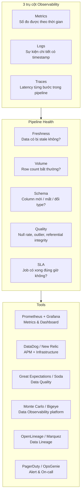

### 18.1 Metrics — đo gì

**Ví dụ:** Grab data platform monitor 5 loại metric cho mỗi pipeline.

```python
# Custom metrics với Prometheus
from prometheus_client import Counter, Gauge, Histogram, start_http_server

# 1. Throughput: rows processed per second
rows_processed = Counter(
    "pipeline_rows_processed_total",
    "Total rows processed",
    labelnames=["pipeline_name", "source_table", "status"]
)

# 2. Latency: thời gian từ event xảy ra đến khi available trong DWH
ingestion_lag = Gauge(
    "pipeline_ingestion_lag_seconds",
    "Seconds between event creation and DWH availability",
    labelnames=["pipeline_name"]
)

# 3. Job duration
job_duration = Histogram(
    "pipeline_job_duration_seconds",
    "Job run duration",
    labelnames=["dag_id", "task_id"],
    buckets=[60, 300, 600, 1800, 3600, 7200]
)

# 4. Error rate
errors = Counter(
    "pipeline_errors_total",
    "Total pipeline errors",
    labelnames=["pipeline_name", "error_type"]
)

# Sử dụng trong pipeline
def process_batch(rows: list, pipeline_name: str):
    start = time.time()
    try:
        result = transform_and_load(rows)
        rows_processed.labels(
            pipeline_name=pipeline_name,
            source_table="orders",
            status="success"
        ).inc(len(rows))
        return result
    except Exception as e:
        errors.labels(pipeline_name=pipeline_name, error_type=type(e).__name__).inc()
        raise
    finally:
        job_duration.labels(
            dag_id="daily_pipeline",
            task_id="process_orders"
        ).observe(time.time() - start)
```

### 18.2 Data Quality checks — ví dụ thực tế

**Ví dụ:** Tiki dùng Great Expectations để validate data sau mỗi pipeline run.

```python
import great_expectations as gx

context = gx.get_context()
batch = context.sources.pandas_default.read_parquet("s3://tiki-staging/orders/2024-01-15/")

# Define expectations
suite = context.add_expectation_suite("orders_daily")

# Volume check: số orders hôm nay phải trong khoảng hợp lý
suite.add_expectation(
    gx.expectations.ExpectTableRowCountToBeBetween(min_value=50_000, max_value=500_000)
)

# Null check: required fields không được null
suite.add_expectation(
    gx.expectations.ExpectColumnValuesToNotBeNull(column="order_id")
)
suite.add_expectation(
    gx.expectations.ExpectColumnValuesToNotBeNull(column="user_id")
)

# Range check: amount hợp lý
suite.add_expectation(
    gx.expectations.ExpectColumnValuesToBeBetween(
        column="amount", min_value=1000, max_value=500_000_000
    )
)

# Freshness: không có order nào older than 48 giờ trong daily load
suite.add_expectation(
    gx.expectations.ExpectColumnValuesToBeBetween(
        column="created_at_epoch",
        min_value=int((datetime.now() - timedelta(hours=48)).timestamp())
    )
)

# Run validation
results = context.run_checkpoint("orders_daily_checkpoint")
if not results["success"]:
    # Fail pipeline, notify team
    raise DataQualityError(f"Data quality failed: {results}")
```

### 18.3 Pipeline tracking table — audit trail

**Mọi pipeline run phải ghi vào tracking table để debug và audit.**

```sql
-- Pipeline run tracking table
CREATE TABLE pipeline_runs (
    run_id          UUID PRIMARY KEY DEFAULT gen_random_uuid(),
    pipeline_name   VARCHAR(200),
    dag_id          VARCHAR(200),
    task_id         VARCHAR(200),
    execution_date  DATE,
    started_at      TIMESTAMPTZ,
    finished_at     TIMESTAMPTZ,
    duration_secs   INT GENERATED ALWAYS AS
                    (EXTRACT(EPOCH FROM finished_at - started_at)) STORED,
    status          VARCHAR(20),    -- 'running' / 'success' / 'failed' / 'skipped'
    rows_read       BIGINT,
    rows_written    BIGINT,
    rows_rejected   BIGINT,
    source_location VARCHAR(500),   -- s3://... hoặc mysql://...
    sink_location   VARCHAR(500),
    error_message   TEXT,
    metadata        JSONB           -- custom key-value per pipeline
);

-- Query để debug: tìm pipeline chậm hơn thường
SELECT
    pipeline_name,
    execution_date,
    duration_secs,
    AVG(duration_secs) OVER (
        PARTITION BY pipeline_name
        ORDER BY execution_date
        ROWS BETWEEN 6 PRECEDING AND CURRENT ROW
    ) AS avg_7day_duration,
    rows_written
FROM pipeline_runs
WHERE status = 'success'
ORDER BY execution_date DESC;
```

```python
# Context manager tự động ghi tracking
from contextlib import contextmanager
import uuid, time

@contextmanager
def track_pipeline(pipeline_name: str, execution_date: str, source: str, sink: str):
    run_id = str(uuid.uuid4())
    started_at = datetime.utcnow()

    db.execute("""
        INSERT INTO pipeline_runs (run_id, pipeline_name, execution_date,
                                   started_at, status, source_location, sink_location)
        VALUES (%s, %s, %s, %s, 'running', %s, %s)
    """, (run_id, pipeline_name, execution_date, started_at, source, sink))

    stats = {"rows_read": 0, "rows_written": 0, "rows_rejected": 0}
    try:
        yield stats
        db.execute("""
            UPDATE pipeline_runs
            SET status='success', finished_at=%s,
                rows_read=%s, rows_written=%s, rows_rejected=%s
            WHERE run_id=%s
        """, (datetime.utcnow(), stats["rows_read"],
              stats["rows_written"], stats["rows_rejected"], run_id))
    except Exception as e:
        db.execute("""
            UPDATE pipeline_runs
            SET status='failed', finished_at=%s, error_message=%s
            WHERE run_id=%s
        """, (datetime.utcnow(), str(e), run_id))
        raise

# Sử dụng
with track_pipeline("orders_daily", "2024-01-15",
                    "mysql://prod-db/orders", "bq://tiki-dw/orders") as stats:
    rows = extract_orders("2024-01-15")
    stats["rows_read"] = len(rows)
    cleaned = transform(rows)
    stats["rows_rejected"] = len(rows) - len(cleaned)
    load_to_bq(cleaned)
    stats["rows_written"] = len(cleaned)
```

### 18.4 Alerting — ví dụ thực tế

**Ví dụ:** Shopee data platform alert strategy theo mức độ nghiêm trọng.

```python
# Alert levels và routing
ALERT_RULES = {
    # P1: Revenue impact — page on-call ngay
    "revenue_pipeline_failed": {
        "severity": "P1",
        "channel": "pagerduty",
        "condition": lambda run: run.pipeline_name == "revenue_daily" and run.status == "failed"
    },
    # P2: SLA miss — Slack + email
    "sla_missed": {
        "severity": "P2",
        "channel": "slack:#data-alerts",
        "condition": lambda run: (
            run.status == "running" and
            (datetime.utcnow() - run.started_at).seconds > run.expected_duration * 1.5
        )
    },
    # P3: Data quality warn — Slack
    "volume_anomaly": {
        "severity": "P3",
        "channel": "slack:#data-quality",
        "condition": lambda run: abs(run.rows_written - run.expected_rows) / run.expected_rows > 0.2
    },
}

def check_and_alert(run):
    for rule_name, rule in ALERT_RULES.items():
        if rule["condition"](run):
            send_alert(
                channel=rule["channel"],
                message=f"""
                [{rule['severity']}] Pipeline Alert: {rule_name}
                Pipeline: {run.pipeline_name}
                Date: {run.execution_date}
                Status: {run.status}
                Rows: {run.rows_written:,} (expected: {run.expected_rows:,})
                Duration: {run.duration_secs}s
                Error: {run.error_message or 'N/A'}
                Runbook: https://wiki/data-platform/{rule_name}
                """
            )
```

### 18.5 Data Lineage — biết data đến từ đâu

**Tốt cho:** Debug khi có data quality issue — tìm nguồn gốc vấn đề.

**Ví dụ:** Analyst báo cáo "doanh thu hôm nay sai" → cần trace ngược lại từ dashboard → dbt model → staging table → MySQL source.

```python
# OpenLineage emit lineage event
from openlineage.client import OpenLineageClient
from openlineage.client.run import RunEvent, RunState, Run, Job
from openlineage.client.facet import DataSourceFacet, SchemaFacet

client = OpenLineageClient(url="http://marquez:5000")

def emit_lineage(job_name: str, input_datasets: list, output_datasets: list):
    run = Run(runId=str(uuid.uuid4()))
    job = Job(namespace="tiki-data-platform", name=job_name)

    client.emit(RunEvent(
        eventType=RunState.START,
        eventTime=datetime.utcnow().isoformat(),
        run=run,
        job=job,
        inputs=[
            {
                "namespace": ds["namespace"],
                "name": ds["name"],
                "facets": {
                    "dataSource": DataSourceFacet(name=ds["source"], uri=ds["uri"])
                }
            } for ds in input_datasets
        ],
        outputs=[
            {"namespace": "bigquery", "name": ds["name"]}
            for ds in output_datasets
        ]
    ))
```

---

## 19. Hệ thống quy mô Netflix

Netflix xử lý 700 triệu giờ xem/ngày, 250 triệu subscribers, data từ 1,000+ microservices. Đây là kiến trúc thực tế và bài học có thể áp dụng.

### Kiến trúc tổng thể

```mermaid
graph TD
    subgraph SOURCES["Sources — 1000+ microservices"]
        S1[Playback Service\nevents: play/pause/seek/buffer]
        S2[Recommendation Service\nevents: impression/click/rating]
        S3[Billing Service\nevents: subscription/charge]
        S4[Content Service\nevents: new_title/metadata_change]
        S5[Device Service\nevents: login/logout/error]
    end

    subgraph INGEST["Ingestion — Kafka tầng trung tâm"]
        K1[Kafka Clusters\n36 clusters · 4,000+ brokers\n700 billion events/day]
        SPY[Keystone — Netflix Kafka\ncustom Kafka với multi-tenant]
    end

    subgraph PROCESS["Processing"]
        SP[Apache Spark\nbatch transform · Iceberg]
        FL[Apache Flink\nrealtime streaming]
        DRUID[Apache Druid\nOLAP realtime queries]
    end

    subgraph STORE["Storage"]
        ICE[Apache Iceberg\nData Lake · S3]
        HIVE[Hive Metastore\ncatalog · schema registry]
        CASS[Cassandra\nfeature store · serving]
        ES[Elasticsearch\nlog search · debug]
    end

    subgraph SERVE["Serving"]
        METATRON[Metacat\ndata catalog · discovery]
        GENIE[Genie\njob service · Spark/Hadoop]
        MAESTRO[Maestro\norchestration · 150K DAGs]
        ATLAS[Atlas\ndata lineage]
    end

    SOURCES --> INGEST --> PROCESS --> STORE --> SERVE
```

### 19.1 Ingestion layer — Keystone (Netflix Kafka)

**Vấn đề Netflix phải giải quyết:**
- 700 tỷ event/ngày = ~8 triệu events/giây liên tục
- 1,000+ microservices cần gửi event — không thể để mỗi service tự manage Kafka connection
- Multi-tenant: mỗi team có topic riêng, không được ảnh hưởng nhau

**Giải pháp: Keystone Producer (client-side library)**
```
Mỗi microservice dùng Keystone SDK thay vì Kafka SDK trực tiếp:
  - Auto-retry với exponential backoff
  - Local buffer khi Kafka slow (tránh block main thread)
  - Schema validation trước khi gửi
  - Metrics emit tự động (lag, throughput, error rate)
  - Graceful degradation: nếu Kafka down → buffer on disk
```

**Kafka routing tại Netflix:**
```
Event Producer → Keystone Router → Kafka Cluster (per region)
                      ↓
              Route theo topic type:
              - high-priority: realtime cluster (SLA < 30s)
              - standard: batch cluster
              - audit: archive cluster (long retention)
```

**Bài học áp dụng cho công ty Vietnam quy mô vừa:**
```
Vấn đề: 50 microservices mỗi cái tự config Kafka producer khác nhau
→ Inconsistent retry, no schema validation, hard to monitor

Giải pháp đơn giản hơn Netflix:
  1. Internal library wrap Kafka producer: retry + metrics + schema check
  2. Schema Registry (Confluent): mọi event phải đăng ký Avro schema
  3. Topic naming convention: {team}.{domain}.{entity}.{version}
     vd: payments.billing.invoice.v2
```

### 19.2 Processing layer — Spark + Iceberg

**Netflix xử lý batch với Apache Spark trên Apache Iceberg:**

```
Mỗi ngày:
  - 10,000+ Spark jobs chạy
  - Genie (job service) manage resource allocation
  - Iceberg format: ACID, time travel, schema evolution

Tại sao Iceberg thay vì Parquet thuần?
  1. ACID: nhiều Spark job ghi vào cùng table cùng lúc — không corrupt
  2. Time travel: rollback nếu job ghi data sai
     SELECT * FROM plays VERSION AS OF '2024-01-15 02:00:00'
  3. Schema evolution: thêm column mà không rewrite toàn bộ file
  4. Partition evolution: đổi partition strategy mà không migrate data
```

```python
# Netflix Iceberg pattern — bài học áp dụng được
from pyspark.sql import SparkSession

spark = SparkSession.builder \
    .config("spark.sql.extensions", "org.apache.iceberg.spark.extensions.IcebergSparkSessionExtensions") \
    .config("spark.sql.catalog.netflix", "org.apache.iceberg.spark.SparkCatalog") \
    .getOrCreate()

# Ghi vào Iceberg table với ACID
df.writeTo("netflix.plays.daily") \
    .option("mergeSchema", "true") \   # schema evolution tự động
    .createOrReplace()

# Time travel: debug data issue
spark.read.option("as-of-timestamp", "2024-01-15 02:00:00") \
    .table("netflix.plays.daily") \
    .show()

# Rollback nếu có lỗi
spark.sql("CALL netflix.system.rollback_to_timestamp('plays.daily', TIMESTAMP '2024-01-15 01:00:00')")
```

### 19.3 Orchestration — Maestro (Netflix)

**Maestro** là workflow engine Netflix tự build vì Airflow không scale đủ:

```
Airflow giới hạn:
  - Scheduler single-process → bottle neck khi > 10K DAGs
  - Mỗi DAG phải static Python file → không dynamic
  - Database-heavy metadata store

Maestro giải quyết:
  - 150,000+ DAGs
  - Horizontal scale scheduler
  - DAG definition bằng YAML/JSON (không phải Python)
  - Steps có thể là: Spark job, Flink job, Jupyter notebook, shell script
  - Parameterized template: 1 template cho 200 country-specific DAGs
```

**Bài học: bạn không cần Maestro — Airflow đủ cho 99% công ty VN**

| Scale | Tool khuyên dùng |
|---|---|
| < 100 DAGs, team < 10 people | Prefect Cloud / Dagster Cloud |
| 100–5,000 DAGs | Apache Airflow (managed: MWAA, Cloud Composer) |
| 5,000–50,000 DAGs | Airflow + tune scheduler, hoặc Dagster |
| > 50,000 DAGs | Build custom như Netflix Maestro |

### 19.4 Data Catalog — Metacat

**Netflix Metacat** là metadata service thống nhất:
```
Vấn đề: data nằm ở nhiều nơi (Hive, Iceberg, Redshift, Cassandra, Elasticsearch)
  → Analyst không biết data ở đâu, schema là gì, ai owns

Metacat giải quyết:
  - Unified API: một endpoint query metadata mọi storage
  - Auto-discovery: crawl và index schema tự động
  - Business glossary: link technical column name → business definition
  - Data ownership: mỗi table/column có owner team
```

**Giải pháp đơn giản hơn cho công ty VN:**
- **DataHub** (LinkedIn open source): data catalog, lineage, governance
- **Apache Atlas**: catalog + lineage cho Hadoop ecosystem
- **dbt docs**: tự động generate catalog từ dbt models — đủ cho team < 20 người

### 19.5 Failure handling ở Netflix scale

**Chaos Engineering cho Data Pipeline:**
```
Netflix áp dụng chaos engineering cho cả data pipeline:
  - Random kill Kafka consumer → test at-least-once delivery
  - Random delay S3 write → test timeout handling
  - Random corrupt 0.01% Parquet file → test bad data handling

Kết quả: pipeline phải idempotent và self-healing
```

```python
# Self-healing pattern — áp dụng được mọi quy mô
class IdempotentPipeline:
    def run(self, execution_date: str):
        # 1. Check đã chạy thành công chưa
        if self.already_succeeded(execution_date):
            logger.info(f"Already succeeded for {execution_date}, skipping")
            return

        # 2. Cleanup partial output nếu run trước fail giữa chừng
        self.cleanup_partial_output(execution_date)

        # 3. Chạy pipeline
        try:
            result = self._run(execution_date)
            self.mark_success(execution_date, result)
        except Exception as e:
            self.mark_failed(execution_date, str(e))
            raise

    def cleanup_partial_output(self, date: str):
        # Xóa output của run trước (nếu có) để tránh partial data
        s3.delete_prefix(f"s3://lake/orders/date={date}/")
        bq.delete_partition(f"orders${date.replace('-', '')}")
```

### 19.6 Lesson learned từ Netflix áp dụng cho công ty Việt Nam

| Netflix challenge | Netflix solution | Phù hợp với công ty VN quy mô vừa |
|---|---|---|
| 8M events/giây từ 1000 services | Keystone SDK wrapper | Confluent Schema Registry + internal Kafka library |
| 10,000 Spark jobs/ngày | Genie job service | Apache Airflow managed (MWAA/Composer) |
| 150,000 DAGs | Maestro custom engine | Airflow (đủ cho < 5,000 DAGs) |
| Schema inconsistency | Metacat unified catalog | DataHub hoặc dbt docs |
| Data quality at scale | Automated expectation suites | Great Expectations hoặc Soda |
| Unknown data ownership | Metacat ownership registry | DataHub + Slack oncall rotation |
| Pipeline failure recovery | Chaos engineering + idempotent design | Idempotent pipeline + retry + DLQ |
| Time travel / rollback | Apache Iceberg | Delta Lake hoặc Iceberg trên S3 |

### 19.7 Ví dụ kiến trúc công ty VN quy mô tương đương (Grab/Shopee/Tiki)

```mermaid
graph TD
    subgraph SOURCES["Sources"]
        APP[Mobile App · Web App]
        MYSQL[MySQL · PostgreSQL OLTP]
        SFTP[Partner SFTP]
        API[3rd party API\nGoogleAds · Salesforce]
    end

    subgraph INGEST["Ingestion"]
        KAFKA[Apache Kafka\n10–50 brokers · Confluent Schema Registry]
        DEB[Debezium CDC\nMySQL binlog → Kafka]
        AIRB[Airbyte\nSFTP + API → Kafka / S3]
    end

    subgraph PROCESS["Processing"]
        SPARK[Apache Spark on EMR\nbatch 2am · Iceberg format]
        FLINK[Apache Flink\nrealtime fraud · leaderboard]
        DBT[dbt · 200 SQL models\ntransform in BigQuery]
    end

    subgraph STORE["Storage"]
        S3[AWS S3 · Iceberg\nData Lake 10–100TB]
        BQ[BigQuery / Snowflake\nData Warehouse]
        REDIS[Redis\nfeature serving < 1ms]
        ES2[Elasticsearch\nproduct search · log]
    end

    subgraph SERVE["Serve"]
        LOOKER[Looker · Metabase\nBI Dashboard]
        AIRFLOW[Apache Airflow\n500 DAGs · MWAA managed]
        GE[Great Expectations\ndata quality gate]
        DATAHUB[DataHub\ncatalog · lineage]
    end

    SOURCES --> INGEST --> PROCESS --> STORE --> SERVE
```

---
