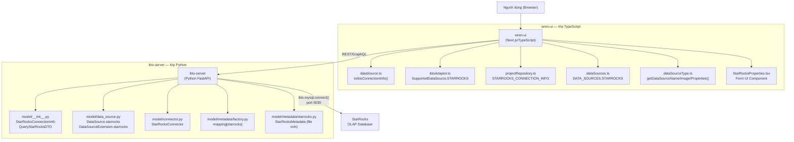
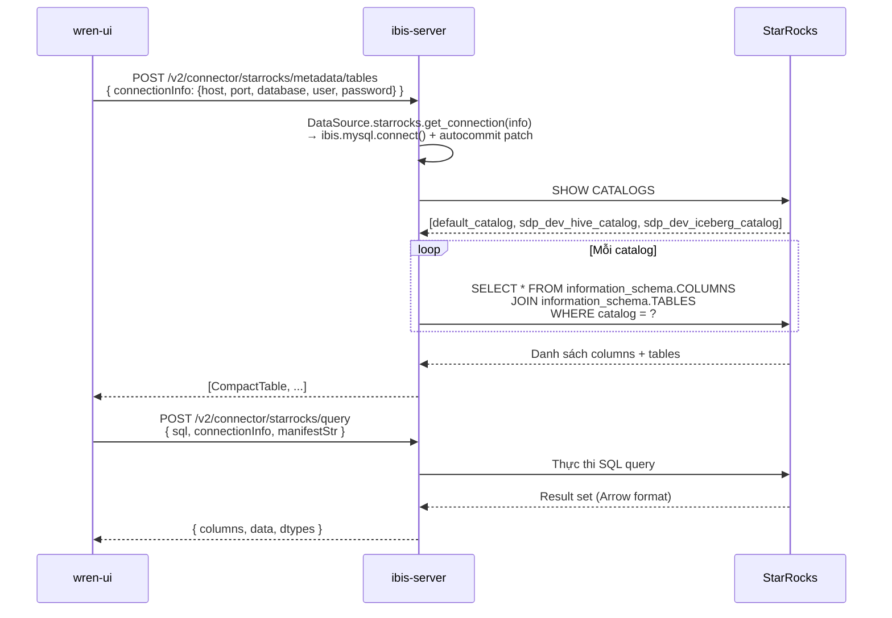

# Design Document: StarRocks Connector

## Overview

StarRocks là một OLAP database hiệu năng cao sử dụng MySQL wire protocol (port mặc định 9030). Feature này tích hợp StarRocks vào Wren AI bằng cách follow đúng pattern của Doris connector — vốn cũng dùng MySQL protocol — với các điều chỉnh đặc thù của StarRocks: type mapping khác biệt và hỗ trợ **multi-catalog** (StarRocks có thể expose nhiều catalogs bao gồm native `default_catalog` và các external catalogs Hive/Iceberg).

Phạm vi thay đổi trải rộng trên hai service: **ibis-server** (Python/FastAPI) chịu trách nhiệm kết nối database và thực thi query, và **wren-ui** (TypeScript/Next.js) chịu trách nhiệm giao diện người dùng và chuyển đổi connection info.

---

## Architecture



### Luồng dữ liệu chính



---

## Components and Interfaces

### ibis-server: StarRocksConnectionInfo (model/__init__.py)

**Mục đích**: Pydantic model chứa thông tin kết nối StarRocks, dùng làm typed container cho connection info đi qua toàn bộ ibis-server pipeline.

```python
class StarRocksConnectionInfo(BaseConnectionInfo):
    host: SecretStr      # Hostname FE node
    port: SecretStr      # Default "9030" (MySQL protocol port)
    database: SecretStr  # Database/catalog mặc định khi kết nối
    user: SecretStr      # Username
    password: SecretStr | None = None
    kwargs: dict[str, str] | None = None  # Extra kwargs truyền xuống ibis.mysql.connect()

class QueryStarRocksDTO(QueryDTO):
    connection_info: StarRocksConnectionInfo = connection_info_field
```

`StarRocksConnectionInfo` cũng được thêm vào `ConnectionInfo` union type (cuối file `__init__.py`).

---

### ibis-server: DataSource.starrocks (model/data_source.py)

**Mục đích**: Đăng ký StarRocks vào enum `DataSource` và `DataSourceExtension`, cung cấp factory method để tạo ibis connection.

#### DataSource enum

```python
class DataSource(StrEnum):
    # ... existing entries ...
    starrocks = auto()
```

#### DataSourceExtension enum

```python
class DataSourceExtension(Enum):
    # ... existing entries ...
    starrocks = QueryStarRocksDTO
```

#### get_starrocks_connection() — static method trong DataSourceExtension

```python
@classmethod
def get_starrocks_connection(cls, info: StarRocksConnectionInfo) -> BaseBackend:
    kwargs = {}
    kwargs.setdefault("charset", "utf8mb4")
    if info.kwargs:
        kwargs.update(info.kwargs)
    
    # StarRocks dùng MySQL protocol qua ibis.mysql.connect()
    connection = ibis.mysql.connect(
        host=info.host.get_secret_value(),
        port=int(info.port.get_secret_value()),
        database=info.database.get_secret_value(),
        user=info.user.get_secret_value(),
        password=info.password.get_secret_value() if info.password else "",
        **kwargs,
    )
    # StarRocks — giống Doris — không phản ánh đúng SERVER_STATUS_AUTOCOMMIT
    # trong MySQL protocol handshake. Patch giống Doris connector:
    connection.con.get_autocommit = lambda: True
    return connection
```

#### _build_connection_info() — thêm case StarRocks

```python
case DataSource.starrocks:
    return StarRocksConnectionInfo.model_validate(data)
```

---

### ibis-server: StarRocksConnector (model/connector.py)

**Mục đích**: Connector class xử lý query execution, đặc biệt xử lý JSON columns và PyArrow type incompatibilities.

```python
class StarRocksConnector(IbisConnector):
    """StarRocks connector — sử dụng MySQL protocol qua ibis.mysql backend.
    
    StarRocks là OLAP database tương thích MySQL protocol.
    Autocommit được force enable tương tự Doris connector.
    """
    
    def __init__(self, connection_info: ConnectionInfo):
        super().__init__(DataSource.starrocks, connection_info)

    def _handle_pyarrow_unsupported_type(self, ibis_table: Table, **kwargs) -> Table:
        result_table = ibis_table
        for name, dtype in ibis_table.schema().items():
            if isinstance(dtype, Decimal):
                result_table = self._round_decimal_columns(
                    result_table=result_table, col_name=name, **kwargs
                )
            elif isinstance(dtype, UUID):
                result_table = self._cast_uuid_columns(
                    result_table=result_table, col_name=name
                )
            elif isinstance(dtype, dt.JSON):
                # StarRocks JSON columns cần convert sang string (giống MySQL/Doris)
                result_table = self._cast_json_columns(
                    result_table=result_table, col_name=name
                )
        return result_table

    def _cast_json_columns(self, result_table: Table, col_name: str) -> Table:
        col = result_table[col_name]
        casted_col = col.cast("string")
        return result_table.mutate(**{col_name: casted_col})
```

Thêm vào `Connector.__init__()`:

```python
elif data_source == DataSource.starrocks:
    self._connector = StarRocksConnector(connection_info)
```

---

### ibis-server: StarRocksMetadata (model/metadata/starrocks.py) — file mới

**Mục đích**: Metadata class cung cấp `get_table_list()`, `get_schema_list()`, `get_constraints()`, `get_version()` cho StarRocks. Điểm khác biệt chính so với DorisMetadata là **multi-catalog support**.

#### Class declaration

```python
class StarRocksMetadata(Metadata):
    def __init__(self, connection_info: StarRocksConnectionInfo):
        super().__init__(connection_info)
        self.connection = DataSource.starrocks.get_connection(connection_info)
        self.database = connection_info.database.get_secret_value()
```

#### StarRocks Type Mapping

```python
STARROCKS_TYPE_MAPPING = {
    # ── String Types ────────────────────────────
    "char":      RustWrenEngineColumnType.CHAR,
    "varchar":   RustWrenEngineColumnType.VARCHAR,
    "string":    RustWrenEngineColumnType.VARCHAR,
    "text":      RustWrenEngineColumnType.TEXT,
    # ── Numeric Types ───────────────────────────
    "tinyint":   RustWrenEngineColumnType.TINYINT,
    "smallint":  RustWrenEngineColumnType.SMALLINT,
    "int":       RustWrenEngineColumnType.INTEGER,
    "integer":   RustWrenEngineColumnType.INTEGER,
    "mediumint": RustWrenEngineColumnType.INTEGER,
    "bigint":    RustWrenEngineColumnType.BIGINT,
    "largeint":  RustWrenEngineColumnType.BIGINT,  # StarRocks 128-bit int → BIGINT
    # ── Boolean ─────────────────────────────────
    "boolean":   RustWrenEngineColumnType.BOOL,
    "bool":      RustWrenEngineColumnType.BOOL,
    # ── Decimal Types ───────────────────────────
    "float":     RustWrenEngineColumnType.FLOAT8,
    "double":    RustWrenEngineColumnType.DOUBLE,
    "decimal":   RustWrenEngineColumnType.DECIMAL,
    "decimalv3": RustWrenEngineColumnType.DECIMAL,
    "numeric":   RustWrenEngineColumnType.NUMERIC,
    # ── Date/Time Types ─────────────────────────
    "date":      RustWrenEngineColumnType.DATE,
    "datetime":  RustWrenEngineColumnType.TIMESTAMP,
    "timestamp": RustWrenEngineColumnType.TIMESTAMPTZ,
    # ── JSON / Semi-structured ───────────────────
    "json":      RustWrenEngineColumnType.JSON,
    # ── Complex Types ───────────────────────────
    "array":     RustWrenEngineColumnType.JSON,
    "map":       RustWrenEngineColumnType.JSON,
    "struct":    RustWrenEngineColumnType.JSON,
    # ── StarRocks-specific aggregate types ──────
    "hll":        RustWrenEngineColumnType.VARCHAR,
    "bitmap":     RustWrenEngineColumnType.VARCHAR,
    "percentile": RustWrenEngineColumnType.VARCHAR,
    # NOTE: 'variant', 'agg_state', 'quantile_state' là Doris-specific, KHÔNG có trong StarRocks
}
```

**So sánh với Doris type mapping:**

| Type | Doris | StarRocks | Ghi chú |
|------|-------|-----------|---------|
| `largeint` | ✅ BIGINT | ✅ BIGINT | Cả hai đều có |
| `variant` | ✅ JSON | ❌ Không có | Doris-specific |
| `agg_state` | ✅ VARCHAR | ❌ Không có | Doris-specific |
| `quantile_state` | ✅ VARCHAR | ❌ Không có | Doris-specific |
| `percentile` | ❌ Không có | ✅ VARCHAR | StarRocks-specific |

#### get_table_list() — query across all catalogs

```python
def get_table_list(self) -> list[Table]:
    """Lấy danh sách tables từ TẤT CẢ catalogs."""
    catalogs = self._get_catalog_names()
    unique_tables = {}
    
    for catalog in catalogs:
        sql = f"""
            SELECT
                '{catalog}' AS catalog_name,
                c.TABLE_SCHEMA AS table_schema,
                c.TABLE_NAME AS table_name,
                c.COLUMN_NAME AS column_name,
                c.COLUMN_TYPE AS data_type,
                c.IS_NULLABLE AS is_nullable,
                c.COLUMN_KEY AS column_key,
                c.COLUMN_COMMENT AS column_comment,
                t.TABLE_COMMENT AS table_comment
            FROM {catalog}.information_schema.COLUMNS c
            JOIN {catalog}.information_schema.TABLES t
                ON c.TABLE_SCHEMA = t.TABLE_SCHEMA
                AND c.TABLE_NAME = t.TABLE_NAME
            WHERE c.TABLE_SCHEMA NOT IN (
                'information_schema', '__internal_schema',
                'mysql', 'performance_schema', 'sys'
            )
            ORDER BY c.TABLE_SCHEMA, c.TABLE_NAME, c.ORDINAL_POSITION
        """
        try:
            response = self.connection.sql(sql).to_pandas().to_dict(orient="records")
            self._merge_rows_into_tables(response, catalog, unique_tables)
        except Exception as e:
            logger.warning(f"Failed to list tables from catalog {catalog}: {e}")
    
    return list(unique_tables.values())
```

Tên table được format theo convention `catalog.schema.table` để phân biệt giữa các catalogs:

```python
def _format_compact_table_name(self, catalog: str, schema: str, table: str) -> str:
    if catalog == "default_catalog":
        # Native catalog: dùng format quen thuộc schema.table
        return f"{schema}.{table}"
    # External catalog: thêm catalog prefix để tránh collision
    return f"{catalog}.{schema}.{table}"
```

#### get_schema_list() — multi-catalog support

```python
def get_schema_list(self, filter_info=None, limit=None) -> list[Catalog]:
    """Trả về danh sách Catalog objects, mỗi catalog chứa list schemas."""
    catalog_names = self._get_catalog_names()
    result = []
    
    for catalog_name in catalog_names:
        sql = f"""
            SELECT SCHEMA_NAME
            FROM {catalog_name}.information_schema.SCHEMATA
            WHERE SCHEMA_NAME NOT IN (
                'information_schema', '__internal_schema',
                'mysql', 'performance_schema', 'sys'
            )
            ORDER BY SCHEMA_NAME
        """
        if limit is not None:
            sql += f" LIMIT {int(limit)}"
        try:
            response = self.connection.sql(sql).to_pandas()
            schemas = response["SCHEMA_NAME"].tolist()
            result.append(Catalog(name=catalog_name, schemas=schemas))
        except Exception as e:
            logger.warning(f"Failed to list schemas from catalog {catalog_name}: {e}")
    
    return result

def _get_catalog_names(self) -> list[str]:
    """Query StarRocks SHOW CATALOGS để lấy danh sách tất cả catalogs."""
    try:
        response = self.connection.sql("SHOW CATALOGS").to_pandas()
        # StarRocks trả về column 'CatalogName'
        return response["CatalogName"].tolist()
    except Exception as e:
        logger.warning(f"Failed to list catalogs, falling back to default_catalog: {e}")
        return ["default_catalog"]
```

#### get_constraints() và get_version()

```python
def get_constraints(self) -> list[Constraint]:
    # StarRocks không hỗ trợ foreign key constraints.
    return []

def get_version(self) -> str:
    return self.connection.sql("SELECT version()").to_pandas().iloc[0, 0]
```

---

### ibis-server: MetadataFactory (model/metadata/factory.py)

```python
from app.model.metadata.starrocks import StarRocksMetadata

mapping = {
    # ... existing entries ...
    DataSource.starrocks: StarRocksMetadata,
}
```

---

### wren-ui: DATA_SOURCES enum (src/utils/enum/dataSources.ts)

```typescript
export enum DATA_SOURCES {
  // ... existing entries ...
  STARROCKS = 'STARROCKS',
}
```

---

### wren-ui: DataSourceName enum (src/apollo/server/types/dataSource.ts)

```typescript
export enum DataSourceName {
  // ... existing entries ...
  STARROCKS = 'STARROCKS',
}
```

---

### wren-ui: STARROCKS_CONNECTION_INFO (src/apollo/server/repositories/projectRepository.ts)

```typescript
export interface STARROCKS_CONNECTION_INFO {
  host: string;
  port: number;
  user: string;
  password: string;
  database: string;
}

// Thêm vào WREN_AI_CONNECTION_INFO union type:
export type WREN_AI_CONNECTION_INFO =
  | /* ...existing types... */
  | STARROCKS_CONNECTION_INFO;
```

---

### wren-ui: SupportedDataSource và dataSourceUrlMap (src/apollo/server/adaptors/ibisAdaptor.ts)

```typescript
export enum SupportedDataSource {
  // ... existing entries ...
  STARROCKS = 'STARROCKS',
}

const dataSourceUrlMap: Record<SupportedDataSource, string> = {
  // ... existing entries ...
  [SupportedDataSource.STARROCKS]: 'starrocks',
};
```

---

### wren-ui: dataSource entry (src/apollo/server/dataSource.ts)

```typescript
[DataSourceName.STARROCKS]: {
  sensitiveProps: ['password'],
  toIbisConnectionInfo(connectionInfo) {
    const decryptedConnectionInfo = decryptConnectionInfo(
      DataSourceName.STARROCKS,
      connectionInfo,
    );
    const { host, port, database, user, password } =
      decryptedConnectionInfo as STARROCKS_CONNECTION_INFO;
    return {
      host,
      port,
      database,
      user,
      password,
    };
  },
} as IDataSourceConnectionInfo<STARROCKS_CONNECTION_INFO, HostBasedConnectionInfo>,
```

---

### wren-ui: dataSourceType.ts

Ba functions cần cập nhật để nhận biết `DATA_SOURCES.STARROCKS`:

```typescript
// getDataSourceImage()
case DATA_SOURCES.STARROCKS:
  return '/images/dataSource/starrocks.svg';

// getDataSourceName()
case DATA_SOURCES.STARROCKS:
  return 'StarRocks';

// getDataSourceProperties()
case DATA_SOURCES.STARROCKS:
  return StarRocksProperties;
```

---

### wren-ui: StarRocksProperties.tsx (file mới)

Component form UI cho người dùng nhập connection info. Copy từ `MySQLProperties.tsx`, đổi port placeholder thành `9030` và bỏ SSL toggle (StarRocks thường không cần SSL riêng).

```tsx
import { Form, Input } from 'antd';
import { ERROR_TEXTS } from '@/utils/error';
import { FORM_MODE } from '@/utils/enum';
import { hostValidator } from '@/utils/validator';

interface Props {
  mode?: FORM_MODE;
}

export default function StarRocksProperties(props: Props) {
  const { mode } = props;
  const isEditMode = mode === FORM_MODE.EDIT;
  return (
    <>
      <Form.Item label="Display name" name="displayName" required ...>
        <Input />
      </Form.Item>
      <Form.Item label="Host" name="host" required ...>
        <Input placeholder="10.1.1.1" disabled={isEditMode} />
      </Form.Item>
      <Form.Item label="Port" name="port" required ...>
        <Input placeholder="9030" disabled={isEditMode} />
      </Form.Item>
      <Form.Item label="Username" name="user" required ...>
        <Input />
      </Form.Item>
      <Form.Item label="Password" name="password">
        <Input.Password placeholder="input password" />
      </Form.Item>
      <Form.Item label="Database name" name="database" required ...>
        <Input placeholder="StarRocks database name" disabled={isEditMode} />
      </Form.Item>
    </>
  );
}
```

---

## Data Models

### Connection Info Flow

```mermaid
graph LR
    A["STARROCKS_CONNECTION_INFO\n(TypeScript interface)\n- host: string\n- port: number\n- user: string\n- password: string\n- database: string"] 
    -->|"toIbisConnectionInfo()\nencode password"| 
    B["HostBasedConnectionInfo\n(JSON body gửi ibis-server)\n- host\n- port\n- database\n- user\n- password"]
    -->|"model_validate()"| 
    C["StarRocksConnectionInfo\n(Pydantic model)\n- host: SecretStr\n- port: SecretStr\n- database: SecretStr\n- user: SecretStr\n- password: SecretStr | None"]
    -->|"get_starrocks_connection()"| 
    D["ibis MySQL Backend\n(ibis.mysql.connect)\n+ autocommit patch"]
```

### Multi-Catalog Table Naming Convention

StarRocks expose tables từ nhiều catalogs. Wren AI cần phân biệt rõ catalog nguồn của mỗi table:

| Catalog | Schema | Table | Tên trong Wren AI |
|---------|--------|-------|-------------------|
| `default_catalog` | `sdp_near_realtime` | `raw_dmp_evt_connectivity` | `sdp_near_realtime.raw_dmp_evt_connectivity` |
| `sdp_dev_hive_catalog` | `sdp_raw` | `raw_dmp_public_device` | `sdp_dev_hive_catalog.sdp_raw.raw_dmp_public_device` |
| `sdp_dev_iceberg_catalog` | `sdp_staging` | `stg_dmp_devices` | `sdp_dev_iceberg_catalog.sdp_staging.stg_dmp_devices` |

Tables từ `default_catalog` dùng format ngắn `schema.table` (backward compatible), tables từ external catalogs dùng format đầy đủ `catalog.schema.table`.

---

## Error Handling

### Lỗi kết nối

| Tình huống | Hành vi |
|-----------|---------|
| Host không truy cập được | `WrenError(ErrorCode.GET_CONNECTION_ERROR, ...)` từ `DataSourceExtension.get_connection()` |
| Sai credentials | MySQL auth error được wrap trong `WrenError` |
| Port sai | Connection timeout → `WrenError` |

### Lỗi Multi-Catalog

Multi-catalog query có thể fail một phần (ví dụ external catalog offline). `StarRocksMetadata` xử lý gracefully:

```python
for catalog in catalogs:
    try:
        # Query catalog
        ...
    except Exception as e:
        logger.warning(f"Failed to list tables from catalog {catalog}: {e}")
        # Tiếp tục với catalog tiếp theo, không fail toàn bộ
```

### Autocommit Issue (giống Doris)

StarRocks — giống Doris — không phản ánh đúng `SERVER_STATUS_AUTOCOMMIT` trong MySQL protocol handshake. Không patch sẽ dẫn đến lỗi:

> "This is in a transaction, only insert, update, delete, commit, rollback is acceptable."

Fix: `connection.con.get_autocommit = lambda: True` override per-instance, không ảnh hưởng các connection khác.

### Unknown Type Warning

Khi gặp StarRocks type chưa có trong mapping:

```python
if mapped_type == RustWrenEngineColumnType.UNKNOWN:
    logger.warning(f"Unknown StarRocks data type: {data_type}")
```

---

## Testing Strategy

### Unit Tests (ibis-server)

**Test file**: `tests/model/metadata/test_starrocks.py`

| Test Case | Mô tả |
|-----------|-------|
| `test_type_mapping_largeint` | `largeint` → `BIGINT` |
| `test_type_mapping_percentile` | `percentile` → `VARCHAR` |
| `test_type_mapping_doris_types_absent` | `variant`, `agg_state`, `quantile_state` không có trong StarRocks mapping → `UNKNOWN` |
| `test_type_mapping_with_precision` | `decimal(18,4)` → `DECIMAL` (strip precision trước khi lookup) |
| `test_get_table_list_multi_catalog` | Mock `SHOW CATALOGS` trả về 2 catalogs, verify table list gộp từ cả hai |
| `test_get_schema_list_multi_catalog` | Verify mỗi catalog xuất hiện một lần trong kết quả |
| `test_get_catalog_names_fallback` | Khi `SHOW CATALOGS` fail → fallback về `["default_catalog"]` |
| `test_get_constraints_empty` | `get_constraints()` luôn trả về `[]` |
| `test_table_naming_default_catalog` | `default_catalog` → format `schema.table` |
| `test_table_naming_external_catalog` | External catalog → format `catalog.schema.table` |
| `test_catalog_failure_graceful` | Một catalog fail → catalog còn lại vẫn được query |

**Test file**: `tests/model/test_connector_starrocks.py`

| Test Case | Mô tả |
|-----------|-------|
| `test_json_column_cast` | JSON column được cast sang string |
| `test_decimal_column_rounding` | Decimal column được round |

### Integration Tests (wren-ui)

| Test Case | Mô tả |
|-----------|-------|
| `toIbisConnectionInfo STARROCKS` | Verify mapping từ `STARROCKS_CONNECTION_INFO` → `HostBasedConnectionInfo` |
| `encryptConnectionInfo STARROCKS` | Verify `password` được encrypt |
| `getDataSourceName STARROCKS` | Trả về `'StarRocks'` |
| `getDataSourceImage STARROCKS` | Trả về đúng SVG path |

---

## Correctness Properties

Các bất biến cần đảm bảo trong suốt lifecycle của connector:

1. **Type mapping completeness**: Với mọi StarRocks column type đã biết trong `STARROCKS_TYPE_MAPPING`, `_transform_column_type()` phải trả về đúng `RustWrenEngineColumnType` — không bao giờ trả về `UNKNOWN` cho các type đã liệt kê.

2. **Type mapping exclusion**: `variant`, `agg_state`, `quantile_state` là Doris-specific types — không có trong `STARROCKS_TYPE_MAPPING`. Nếu gặp, kết quả phải là `UNKNOWN` (không map sang giá trị tùy tiện).

3. **Autocommit invariant**: Sau khi `get_starrocks_connection()` trả về connection object, `connection.con.get_autocommit()` luôn trả về `True` — đảm bảo ibis không wrap queries trong `BEGIN/ROLLBACK`.

4. **Multi-catalog graceful degradation**: Nếu `k` trong tổng số `n` catalogs không query được (k < n), `get_table_list()` vẫn trả về kết quả từ `n - k` catalogs còn lại — không raise exception.

5. **Catalog fallback**: Nếu `SHOW CATALOGS` thất bại hoàn toàn, `_get_catalog_names()` trả về `["default_catalog"]` thay vì raise exception.

6. **Connection info immutability**: `StarRocksConnectionInfo` dùng `SecretStr` — giá trị nhạy cảm (password) không bị log ra hoặc serialized ra plain text.

7. **Table naming uniqueness**: Với mọi cặp `(catalog, schema, table)` hợp lệ, `_format_compact_table_name()` tạo ra tên duy nhất — không có collision giữa tables từ các catalogs khác nhau.

---

## Các điểm cần lưu ý khi implement

### 1. `SHOW CATALOGS` syntax

StarRocks hỗ trợ `SHOW CATALOGS` (MySQL-like syntax). Kết quả có column `CatalogName`. Cần test thực tế để xác nhận column name chính xác — có thể là `Catalog` hoặc `CatalogName` tùy version StarRocks.

### 2. Cross-catalog information_schema query

Cú pháp `{catalog}.information_schema.COLUMNS` là StarRocks-specific (không có trong MySQL chuẩn). Cần confirm syntax này hoạt động với phiên bản StarRocks đang dùng.

### 3. StarRocks icon (SVG)

Cần thêm file `/images/dataSource/starrocks.svg` vào `wren-ui/public/images/dataSource/`. Có thể dùng StarRocks official logo từ trang chủ.

### 4. `DORIS` vs `STARROCKS` — không lẫn lộn

Doris và StarRocks đều dùng MySQL protocol port 9030 nhưng là hai sản phẩm riêng biệt. StarRocks bỏ một số Doris-specific types (`variant`, `agg_state`, `quantile_state`) và thêm `percentile`.

### 5. Multi-catalog và connection `database` field

Field `database` trong `StarRocksConnectionInfo` là database mặc định dùng khi kết nối (không phải catalog name). `StarRocksMetadata` sẽ query `SHOW CATALOGS` độc lập để discover tất cả catalogs — không phụ thuộc vào `database` field.

---

## Dependencies

| Dependency | Đã có | Ghi chú |
|------------|-------|---------|
| `ibis-framework[mysql]` | ✅ | Dùng bởi MySQL và Doris connector |
| `PyMySQL` / `mysqlclient` | ✅ | MySQL driver đã có |
| `pydantic` | ✅ | Dùng cho ConnectionInfo models |
| StarRocks JDBC/Driver | ❌ Không cần | Dùng MySQL protocol trực tiếp |

Không cần thêm dependency mới — StarRocks reuse hoàn toàn MySQL ibis backend giống Doris.
