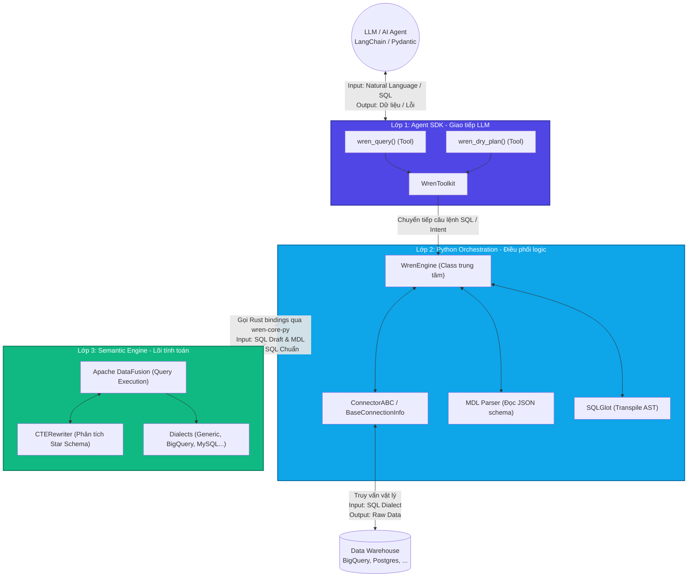
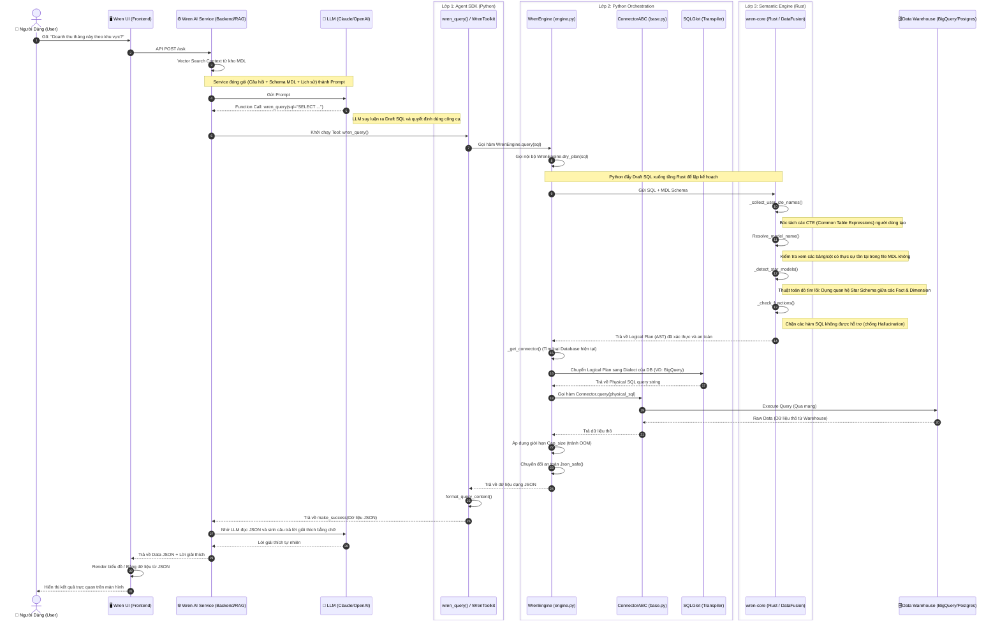

# Phân tích Kiến trúc Hệ thống WrenAI (với GitNexus)

Dựa trên dữ liệu từ **GitNexus**, dưới đây là bản phác họa chi tiết về kiến trúc, luồng thực thi và các công cụ được sử dụng bên trong lõi của WrenAI.

## 1. Trả lời về Framework AI Agent
WrenAI **KHÔNG** sử dụng Haystack. Phân tích thư mục `sdk/` và mã nguồn cho thấy WrenAI hiện đang hỗ trợ chính thức hai framework AI Agent:
*   **LangChain**: Tích hợp thông qua `sdk/wren-langchain`
*   **Pydantic AI**: Tích hợp thông qua `sdk/wren-pydantic`

---

## 2. Tương tác Giữa Các Lớp (Layer Interactions)

Kiến trúc WrenAI được thiết kế theo 3 lớp lõi. Dưới đây là sơ đồ chi tiết về cách các lớp này làm việc với nhau, các cấu trúc dữ liệu, và công cụ cụ thể được phân tích từ codebase:

---

## 3. Luồng Thực thi Cốt lõi (`wren_query` Workflow)

Từ kết quả của GitNexus (`Wren_query → _detect_star_models`, Step Count: 8), luồng xử lý truy vấn đi qua các bước rất khắt khe để đảm bảo AI sinh ra mã chính xác. Dưới đây là Workflow tương tác (Sequence Diagram) thể hiện Input/Output chi tiết:

### Phân tích Sâu từng Nút thắt (Deep-dive Analysis):
1.  **Từ User đến Engine (Bước 1 - 2):** Người dùng không bao giờ chạm trực tiếp vào Engine. Mọi yêu cầu được Wren AI Service (hệ thống backend tách rời chứa UI) bọc lại bằng RAG và ép LLM phải sử dụng Tool `wren_query`.
2.  **Bức tường lửa (Bước 3):** Hàm `dry_plan` của Python Engine lập tức ném câu SQL còn non nớt của LLM xuống tầng Rust. Tại đây, Rust dùng các thuật toán như `_detect_star_models` để vẽ lại cấu trúc bảng (đảm bảo đúng ngữ nghĩa kinh doanh) chứ không tin tưởng hoàn toàn vào câu SQL do LLM viết.
3.  **Dịch ngôn ngữ (Bước 4):** Lõi Rust không sinh ra mã SQL trực tiếp. Nó sinh ra một cái cây trừu tượng (AST). Sau đó Python lấy cây này, đút vào thư viện `SQLGlot` để phiên dịch ra đúng "tiếng địa phương" của cơ sở dữ liệu (Dialect).
4.  **Kiểm soát bộ nhớ (Bước 6):** Nếu DB trả về 1 triệu dòng, việc nạp thẳng vào LLM sẽ làm nổ (Out of Context Window). Do đó Engine có hàm `Cap_size` để chặt bớt dữ liệu trước khi format thành JSON.
5.  **Dựng UI (Bước 7):** Kết quả cuối cùng đi lên UI luôn gồm 2 phần: Dữ liệu JSON (để thư viện Frontend tự dựng biểu đồ) và Lời giải thích do LLM tạo ra. User sẽ nhìn thấy biểu đồ chứ không chỉ thấy chữ.

---

## 4. Tổng kết công cụ (Tech Stack)
*   **Ngôn ngữ:** Python (Điều phối & Agent), Rust (Lõi Engine tính toán), TypeScript (WebAssembly).
*   **Core Engine:** Apache DataFusion (Dùng để xử lý dữ liệu và logic SQL nhanh chóng trên RAM).
*   **Parsing/Transpiling:** SQLGlot (dùng để dịch qua lại giữa các ngôn ngữ SQL).
*   **Agent Integration:** LangChain, Pydantic AI.
*   **Semantic Layer:** MDL (Modeling Definition Language - định dạng schema của WrenAI).
